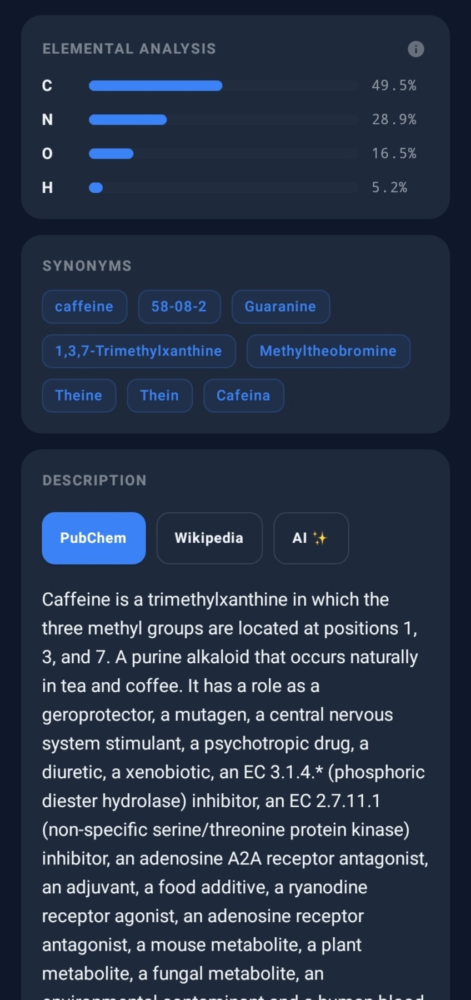
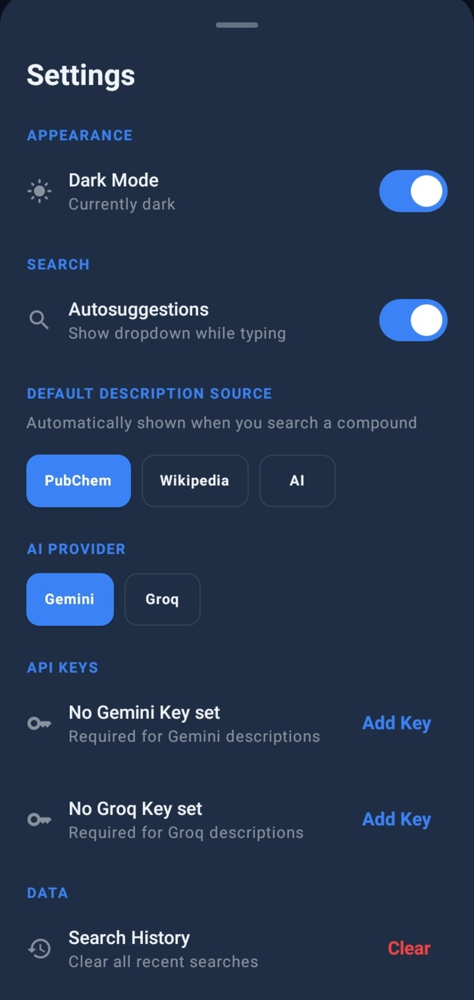
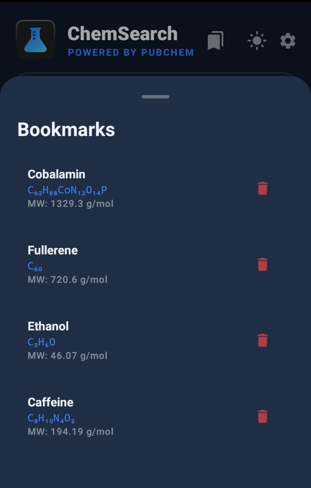

# ChemSearch for Android

<p align="center">
  
</p>

<p align="center">
  <strong>A native Android app for searching and exploring chemical compounds.</strong><br/>
  Built for students, researchers, and anyone curious about chemistry.
</p>

<p align="center">
  <a href="https://github.com/FurtherSecrets24680/chemsearch-android/releases">
    
  </a>
  
  
  
</p>

---

This is the native Android version of the original **ChemSearch** web application, rewritten in Kotlin with Jetpack Compose.

- **Web app:** [chemsearch.netlify.app](https://chemsearch.netlify.app/)
- **Web repo:** [FurtherSecrets24680/chemsearch](https://github.com/FurtherSecrets24680/chemsearch)

---

## Screenshots

### Search & Compound View
<p align="center">
  
  
</p>
<p align="center">
  <sub>Dark mode &nbsp;&nbsp;&nbsp;&nbsp;&nbsp;&nbsp;&nbsp;&nbsp;&nbsp;&nbsp;&nbsp;&nbsp;&nbsp;&nbsp;&nbsp;&nbsp;&nbsp;&nbsp;&nbsp;&nbsp;&nbsp;&nbsp;&nbsp;&nbsp; Light mode</sub>
</p>

### Analysis & Safety
<p align="center">
  
  
</p>
<p align="center">
  <sub>Elemental analysis, synonyms & description &nbsp;&nbsp;&nbsp;&nbsp;&nbsp;&nbsp; GHS safety classification</sub>
</p>

### Settings & Bookmarks
<p align="center">
  
  
</p>
<p align="center">
  <sub>Settings &nbsp;&nbsp;&nbsp;&nbsp;&nbsp;&nbsp;&nbsp;&nbsp;&nbsp;&nbsp;&nbsp;&nbsp;&nbsp;&nbsp;&nbsp;&nbsp;&nbsp;&nbsp;&nbsp;&nbsp;&nbsp;&nbsp;&nbsp;&nbsp;&nbsp;&nbsp;&nbsp;&nbsp;&nbsp;&nbsp;&nbsp;&nbsp; Bookmarks</sub>
</p>

## Features

### Search
- Search by common name, IUPAC name, CAS number, or CID via PubChem PUG REST
- Real-time **autocomplete suggestions** as you type (toggleable)
- Recent **search history** with one-tap access
- **Bookmarks** to save and revisit compounds

### Compound Data
- Compound header showing name, molecular formula, molecular weight, CID and CAS at a glance
- Full identifiers card: IUPAC name, SMILES (full and connectivity), InChI, InChIKey, empirical formula, and formal charge - tap any to copy to clipboard
- **Info tooltips** on each card explaining what each identifier or data type means
- Up to 8 **synonyms** displayed as chips
- **Elemental analysis** with mass percentage bars for each element

### Structure Viewer
- **2D structure** via PubChem PNG images
- **3D model** using a fully native Canvas-based engine:
    - Drag to rotate, pinch to zoom, auto-spin with pause on touch
    - CPK coloring for all 118 elements
    - Ball-and-stick model with bonds connected to atom surfaces
    - Reset view button

### Safety Information
- GHS classification fetched from PubChem PUG View:
    - Signal word badge (Danger / Warning) with color coding
    - GHS pictograms (GHS01 through GHS09) with icons and labels
    - Hazard H-codes
### Descriptions
Three switchable sources per compound:
- **PubChem** for scientific descriptions
- **Wikipedia** for general summaries
- **AI** via Google Gemini or Groq, with a regenerate button

### Customization
- Dark and light mode toggle
- Configurable default description source
- AI provider selection with per-provider API key management
- Autosuggestions toggle

---

## Tech Stack

| Component | Technology |
|---|---|
| Language | Kotlin |
| UI | Jetpack Compose + Material 3 |
| Networking | Retrofit 2 + OkHttp |
| Image loading | Coil |
| Async | Kotlin Coroutines + StateFlow |
| JSON | Gson |
| 3D rendering | Custom native Canvas engine |
| Storage | SharedPreferences |
| Versioning | Git tag-based version name + commit count version code |

---

## Data Sources

| Source | Used for |
|---|---|
| [PubChem PUG REST](https://pubchem.ncbi.nlm.nih.gov/docs/pug-rest) | Compound lookup, properties, synonyms, descriptions, SDF, autocomplete |
| [PubChem PUG View](https://pubchem.ncbi.nlm.nih.gov/docs/pug-view) | GHS safety classifications |
| [Wikipedia REST API](https://en.wikipedia.org/api/rest_v1/) | Compound summaries |
| [Google Gemini](https://ai.google.dev/) | AI descriptions |
| [Groq](https://groq.com/) | AI descriptions |

---

## Requirements

### For Users
- Android 8.0 (Oreo) or higher (API 26+)
- Internet connection for compound data and AI descriptions

### For Developers
- Android Studio Hedgehog (2023.1.1) or newer
- JDK 11
- Android SDK API 34

---

## Building from Source

```bash
git clone https://github.com/FurtherSecrets24680/chemsearch-android
```

Open in Android Studio, sync Gradle, and run on a device or emulator (API 26+). Debug builds work without any API keys configured.

### Release Signing

Create a `keystore.properties` file in the project root:

```properties
storeFile=path/to/your.keystore
storePassword=yourStorePassword
keyAlias=yourKeyAlias
keyPassword=yourKeyPassword
```

Then build via **Build → Generate Signed APK**.

---

## AI Descriptions (Optional)

AI descriptions require a free API key from your chosen provider, entered in the app's Settings.

| Provider | Model                 | Get an API key                                                     |
|---|-----------------------|--------------------------------------------------------------------|
| Google Gemini | `gemini-flash-latest` | [aistudio.google.com/api-keys](https://aistudio.google.com/api-keys) |
| Groq Cloud | `gpt-oss-120b`        | [console.groq.com/keys](https://console.groq.com/keys)                       |

Keys are stored locally on your device and only sent directly to the respective provider.

---

## Privacy

- Data is fetched directly from PubChem, Wikipedia, Gemini and Groq. No intermediary servers are used.
- API keys, search history and bookmarks are stored locally using `SharedPreferences`.
- No analytics, tracking or telemetry of any kind.

---

## License

MIT License. See [LICENSE](LICENSE) for details.

---