# ChemSearch for Android

<p align="center">
  
</p>

<p align="center">
  <strong>ChemSearch: Chemistry simplified.</strong><br/>
  Search compounds, structures, reference and use practical & useful chemistry tools.
</p>

<p align="center">
  <a href="https://github.com/FurtherSecrets24680/chemsearch-android/releases">
    
  </a>
  <a href="https://github.com/FurtherSecrets24680/chemsearch-android/releases">
    
  </a>
  
  
  
</p>

<p align="center">
  <a href="https://www.producthunt.com/products/chemsearch?embed=true&amp;utm_source=badge-featured&amp;utm_medium=badge&amp;utm_campaign=badge-chemsearch" target="_blank" rel="noopener noreferrer">
    
  </a>
</p>

<p align="center">
  <a href="https://github.com/FurtherSecrets24680/chemsearch-android/releases"><strong>Download APK</strong></a>
  -
  <a href="https://github.com/FurtherSecrets24680/chemsearch-android/issues"><strong>Issues</strong></a>
</p>

---

##  About

ChemSearch is a chemistry app for Android I built to make compound lookup less annoying. Search a compound, check the formula and identifiers, open the 2D or 3D structure, read safety notes, save it for offline use, or jump into calculators when you need a quick result. Also includes extra study references such as a Periodic Table and a chemical database containing a list of common substances, ions, functional groups and chemical reactions.

It is meant for students, teachers and quick lab-prep checks. Not a replacement for an SDS or proper lab rules, but handy when you need chemistry data on your phone without bouncing between different websites.

##  Highlights

- Search by compound name, CAS number, formula, CID, drawn structure, or a random compound out of 123 million compounds from **Pubchem**, the world's largest collection of freely accessible chemical information.
- Use advanced filters for query type, include/exclude terms, molecular weight, charge, 3D data, and GHS data.
- Draw a structure in the structure editor and search PubChem by exact, similar, substructure, or superstructure matching.
- View formulas, condensed formulas, identifiers, 2D structures, and interactive 3D molecular models.
- Save full compound data for offline use, including structures, identifiers, descriptions, synonyms, and safety data.
- Compare several compounds side by side from Search, Tools, or Library selections.
- Browse a detailed periodic table with trend comparisons and a built-in chemical database with 600+ entries.
- Use chemistry tools for molar mass, empirical formulas, pH/pOH, oxidation states, reaction balancing, precipitation, stoichiometry, dilution, gas laws, SMILES lookup etc.
- For descriptions, choose out of PubChem, Wikipedia or several AI providers (e.g. Gemini, OpenAI, Groq etc.)
- Choose appearances based on your preference - light/dark mode and different color schemes.

##  Download for Android

- Download the latest APK from [GitHub Releases](https://github.com/FurtherSecrets24680/chemsearch-android/releases).

  - Runs on Android 8.0 Oreo and newer.
  - Minimum SDK: API 26.
  - Target SDK: API 34.
  - Compile SDK: API 36.


##  Screenshots

Click a section to view screenshots.

<details>
<summary><strong>Search And Results</strong></summary>

| Home | 2D Result | Identifiers |
|:---:|:---:|:---:|
| 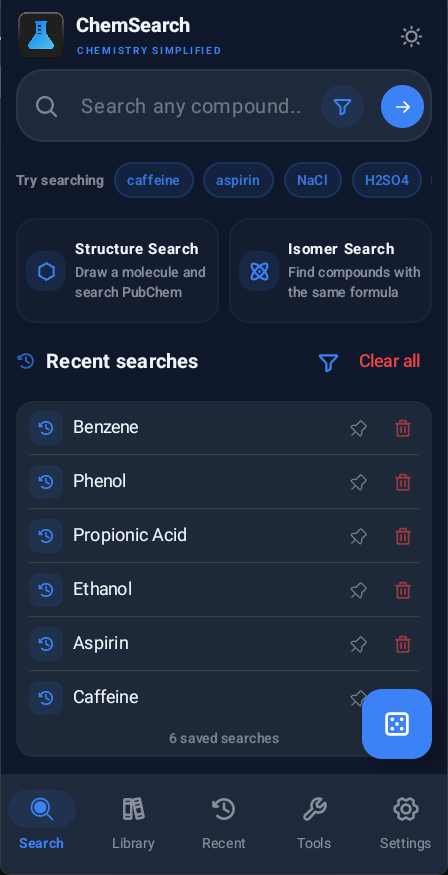 | 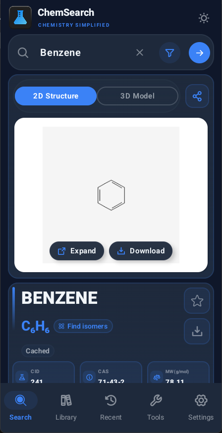 | 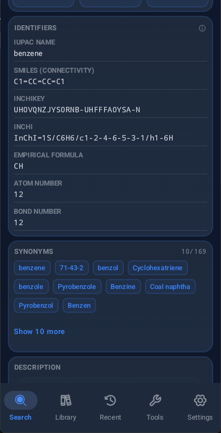 |

| Description And GHS | 3D Result |
|:---:|:---:|
| 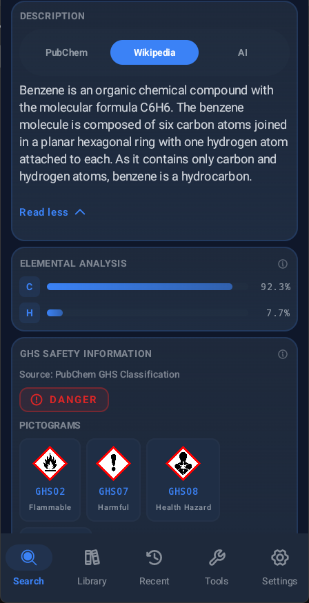 | 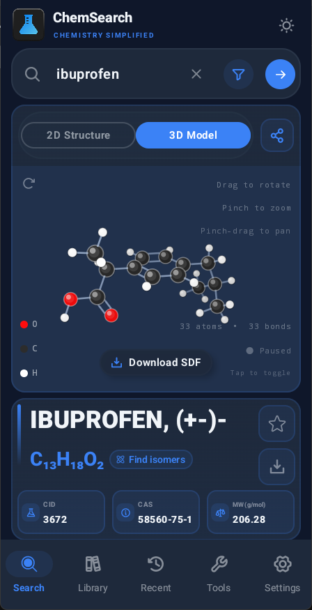 |

</details>

<details>
<summary><strong>Library And Reference</strong></summary>

| Periodic Table | Chemical Database |
|:---:|:---:|
| 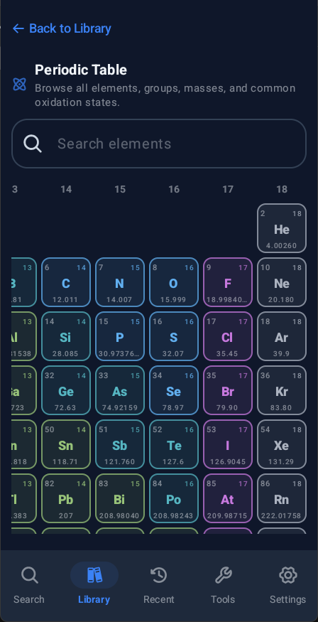 | 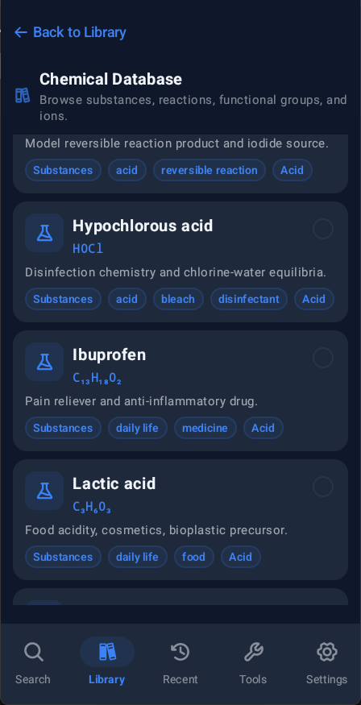 |

</details>

<details>
<summary><strong>Structure And Formula Search</strong></summary>

| Structure Search | Isomer Search |
|:---:|:---:|
| 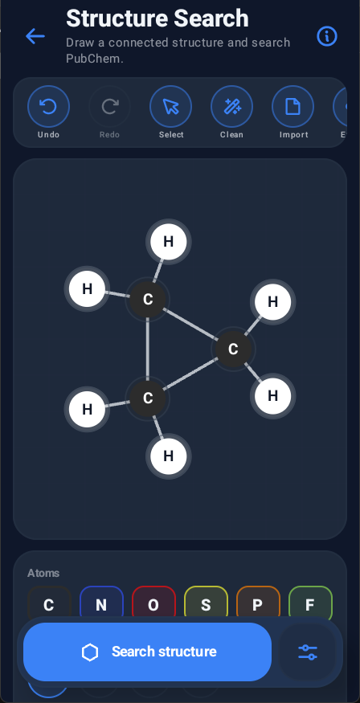 | 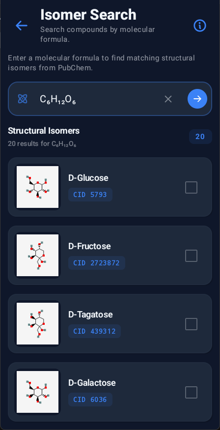 |

</details>

<details>
<summary><strong>Tools</strong></summary>

| Tools List | Reaction Balancer | Molar Mass |
|:---:|:---:|:---:|
| 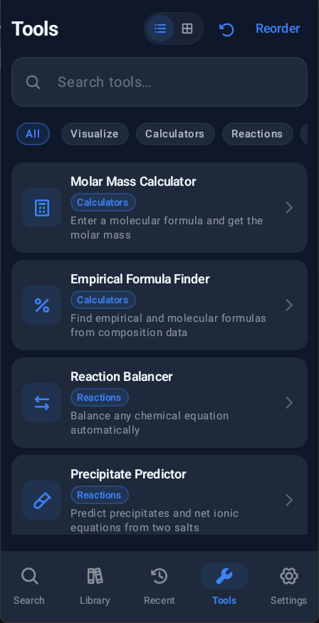 | 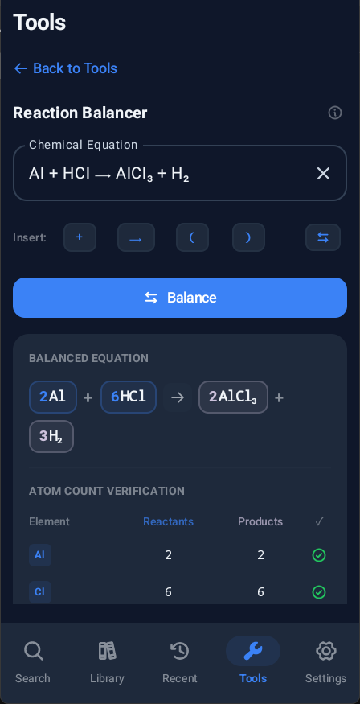 | 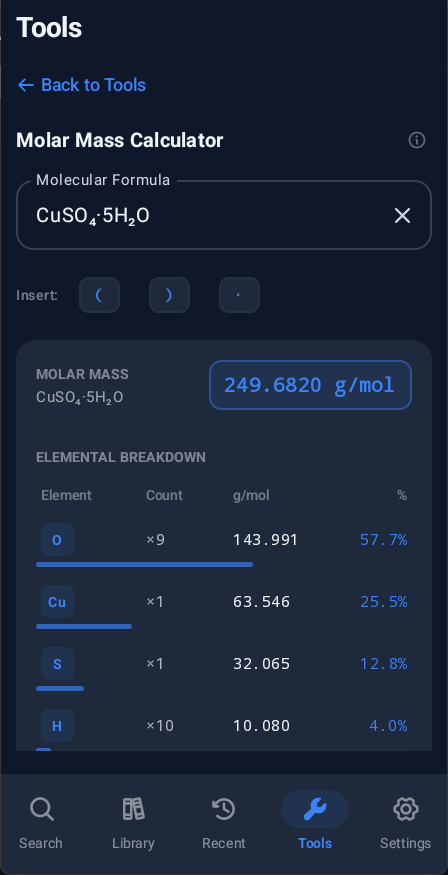 |

| Oxidation State | Compare Compounds | Stoichiometry |
|:---:|:---:|:---:|
| 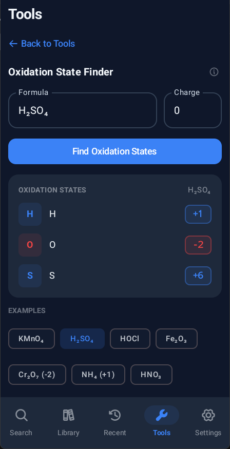 | 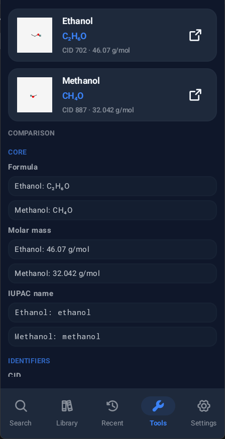 | 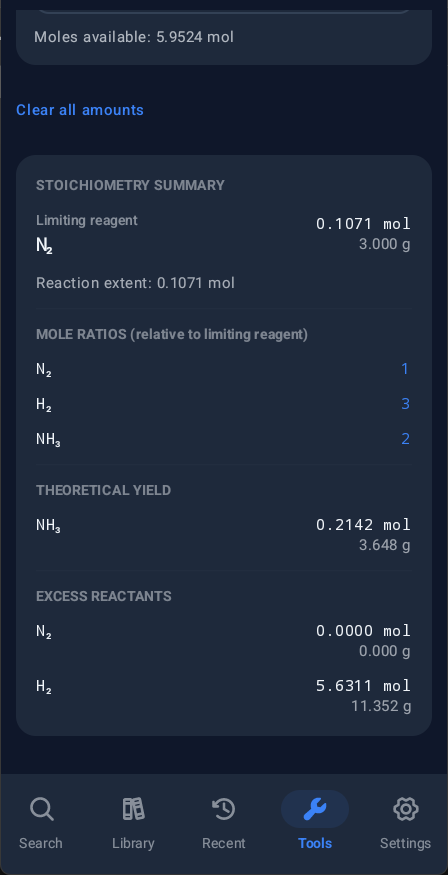 |

</details>

<details>
<summary><strong>Themes And Settings</strong></summary>

| Display Settings | Light Blue | Dark Violet |
|:---:|:---:|:---:|
| 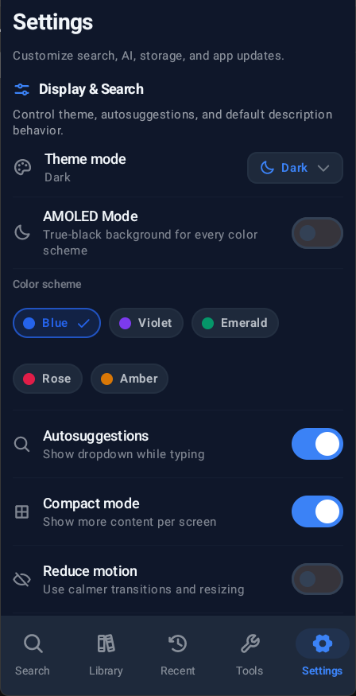 | 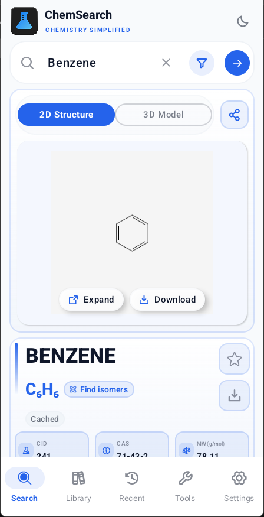 | 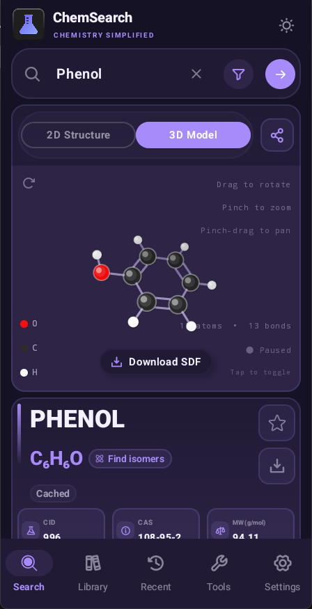 |

| Dark Emerald | Dark Rose | Dark Amber |
|:---:|:---:|:---:|
| 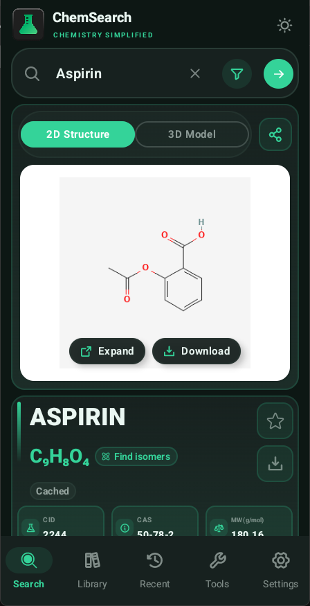 | 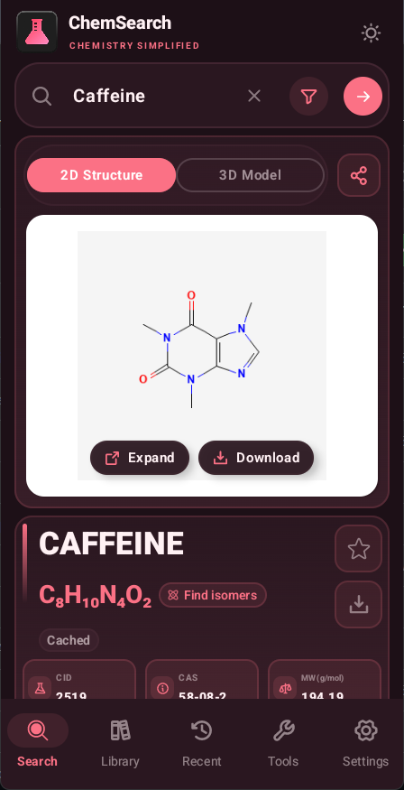 | 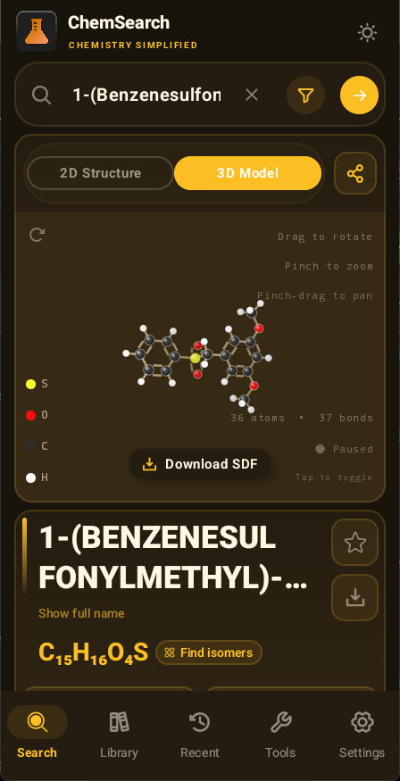 |

</details>

##  Compound Search

ChemSearch can look up compounds using several common identifiers:

- Name, such as `glucose`, `sodium chloride`, `sulfuric acid` or `1,3-dibromopropane`
- CAS number.
- Molecular formula.
- PubChem CID (Compound Identifier)
- Drawn chemical structure.

Autosuggestions can query PubChem while you type, and repeated searches can load faster from the app cache.

When a search has no match or there is a typo, ChemSearch can suggest close spellings.

Advanced search can combine a query type, include and exclude terms, molecular weight range, charge, available 3D data, and available GHS data.

The result page focuses on the details people usually need first:

- Compound name and formula.
- CID, CAS number, molecular weight, condensed formula, and empirical formula when available.
- IUPAC name, InChI, InChIKey, SMILES, and synonyms.
- 2D structure image.
- 3D structure model.
- GHS safety information with official pictograms when available.
- Descriptions from the selected source. (Available sources are PubChem, Wikipedia or AI)
- Advanced PubChem information such as uses, occurrence notes, classification tags, XLogP, polar surface area, exact mass, hydrogen bond counts, and rotatable bond count.
- Isomer search from the formula.
- Favorite and offline download options..

Extra PubChem information sits behind **Show more information about this substance** so the main result page stays readable for everyday searches.

Tap identifiers and quick stats to copy them.

The main home page includes search examples, quick cards for Structure Search and Isomer Search, and a random compound button. Random compound picks a PubChem CID from 123 million available compounds and opens it like any other search result.

Formula display supports 2 ordering styles:

- **Conventional**: familiar ordering for common compounds, such as `NaCl`, `H2SO4`, and `NH4+`.
- **Hill**: PubChem-style Hill ordering, such as `ClNa` or `H4N+` when that is the source formula.

##  Structure Search

Structure search uses a native drawing page. Build a molecule from atoms, bonds, templates, and charges, choose how PubChem should match it, and open matching compounds in the normal result page.

The editor includes:

- Common atoms, a full periodic-table picker, bond types, and structure templates.
- Colored atoms based on common CPK-style colors.
- Select, drag, undo, redo, delete, clean, duplicate, import, export, and share actions.
- Exact, similar, substructure, and superstructure search modes.
- Matching results in a pop-up dialog.


##  Structures

ChemSearch loads structure data from PubChem when it is available.

- 2D structure images are shown directly in the compound page.
- 2D structure images can be tapped to expand and downloaded from the image area.
- 3D models open in the built-in viewer. (The viewer is completely native and does not use any WebView components)
- The default structure tab can be set to 2D, 3D, or the last used tab in settings.
- The native 3D viewer supports drag rotation, pinch zoom, pinch-drag panning, reset and auto-spin.
- If PubChem has no 3D model, ChemSearch can try fallback structure loading from identifiers such as SMILES, InChI, and InChIKey (Fallback structures are marked in the viewer).

Some atoms, metal compounds, ionic solids, and crystal-like materials do not have a useful standalone 3D molecule. In those cases, ChemSearch explains the missing model or labels the fallback as an estimate instead of presenting it as a confirmed crystal structure.

##  Descriptions

Descriptions can come from:

- PubChem.
- Wikipedia.
- A configured AI provider.

AI descriptions are optional. Supported providers are Google Gemini, Groq Cloud, OpenAI, OpenRouter, and Mistral AI. ChemSearch can refresh provider model lists and lets you choose a model per provider.

When AI is enabled, ChemSearch uses available compound details such as formula, identifiers, safety data, and source context to keep the generated text grounded. API keys are stored locally with Android Keystore.

##  Library

The Library page contains your saved favorites, downloads and useful references for chemistry:

- **Favorites**: Saved compounds for quick access.
- **Downloads**: Saved compounds for offline viewing.
- **Reference**: Periodic Table and Chemical Database.

Removing a favorite or downloaded compound shows an undo option, which helps when cleaning up saved items.

Favorites, downloads, substances, and ions can be selected for comparison. When two or more comparable items are selected, a compare button opens the Compare Compounds tool with those compounds filled in.

### Periodic Table
The Periodic Table includes all 118 official elements, element search, trend comparisons, short element dialogs, and full detail pages. Element detail pages include:

- Wikipedia summaries.
- Element images.
- Electron-shell diagrams with Short and full electronic configurations.
- Physical properties such as electronegativity, radius, ionization energy, melting point, boiling point, density, and molar heat.
- Spectral-line images.
- Trend views for comparing listed element properties across the table and trend metrics for electronegativity, atomic radius, ionization energy, density, melting point, and boiling point.

### Chemical Database
The bundled Chemical Database includes:

- Substances: 331.
- Ions: 108.
- Functional groups: 71.
- Reactions: 149.

### Offline Downloads
Offline downloads save more than a cached result. A downloaded compound can include:

- Basic compound details.
- 2D structure image.
- 3D structure data when available.
- Identifiers.
- Descriptions.
- Synonyms.
- GHS safety information.
- Data source notes.

Offline download quality can be set to Basic, Structures, or Complete depending on how much data you want to save.

Downloads are stored in the local app database. Saved compounds show what data is available, such as 2D, 3D, safety, synonyms, descriptions, and identifiers.

The offline save button shows download progress while the compound data is being saved.

Library import and export can move favorites and downloads between installs or devices.

##  Recent Searches

The Recent screen keeps search history organized by time.

- Pin important searches.
- Sort by newest or oldest from the filter menu.
- Browse groups for pinned items, today, yesterday, previous 7 days, previous 30 days, and older searches.
- Remove single entries and clear all recent searches.

##  Tools

ChemSearch includes 14 practical tools for common chemistry activities:

- **Molar Mass Calculator**: Parse a formula and calculate molar mass.
- **Empirical Formula Finder**: Calculate empirical and molecular formulas from percent composition, mass data, or a molecular formula.
- **Oxidation State Finder**: Estimate oxidation states for compounds, including oxyhalogens, peroxides, superoxides, ozonides, hydrides, and mixed-valence cases.
- **pH / pOH Calculator**: Convert between pH, pOH, hydrogen ion concentration, and hydroxide ion concentration.
- **Reaction Balancer**: Balance chemical equations.
- **Precipitate Predictor**: Check two aqueous salts for likely precipitates and net ionic equations.
- **Limiting Reagent**: Lind limiting reagent, mole ratios, and theoretical yield.
- **Percent Yield**: Compare actual yield against theoretical yield.
- **Reaction Scaling**: Scale reactants for a target product amount.
- **Dilution Calculator**: Calculate concentration and volume changes by calculation using the formula: **C<sub>1</sub>V<sub>1</sub> = C<sub>2</sub>V<sub>2</sub>**
- **Ideal Gas Law**: Work with pressure, volume, amount, and temperature by calculation using the Ideal gas law : **PV = nRT**
- **SMILES Visualizer**: Open structure data from SMILES input.
- **Custom 3D Molecule Viewer**: Load local `.sdf` or `.mol` files.
- **Compare Compounds**: Compare formulas, descriptions, identifiers, atom counts, bond counts, molecular weight, and other properties across several compounds.

The Tools page supports search, categories, list/grid layouts, compact mode, long-press drag reordering, and a reset action for returning tools to the default order.

##  Display And Settings

ChemSearch includes display settings for different phones and reading styles:

- Light and dark theme.
- AMOLED Mode for true-black backgrounds in dark mode.
- Color schemes (Blue, Violet, Emerald, Rose & Amber)
- Compact mode.
- Reduce motion.
- High contrast outlines.
- Autosuggestions.
- Default description source.
- Default structure view.
- Formula display style: Conventional or Hill.
- AI provider keys and model selection.
- Offline download quality.
- Cache location and cache clearing.
- Cache size limit: 10 MB, 50 MB, 100 MB, or unlimited.
- Cache auto-clear schedule: daily, weekly, monthly, or manual.
- Settings import and export.
- Internal app update download with progress in Settings.
- Update notifications.
- Update install prompt after the APK finishes downloading.
- About screen with app links, credits, license, privacy notes, and project sources.

##  Developer Options

Developer options include checks for the app's main data paths:

- PubChem lookup.
- PubChem structures.
- PubChem safety data.
- Wikipedia descriptions.
- NCI/CADD fallback structures.
- GitHub release checks.
- Configured AI providers.

Developer options also include debug logs, notification tests, cache and storage summaries, welcome-screen reset, and cleanup tools. Tap the build number five times in the About card to unlock these options.

These checks are useful when a data source changes, a network request fails, or a provider key needs testing.

##  Built With

- [Kotlin](https://kotlinlang.org/)
- [Jetpack Compose](https://developer.android.com/compose)
- [Material 3](https://developer.android.com/develop/ui/compose/designsystems/material3)
- [AndroidX Navigation Compose](https://developer.android.com/develop/ui/compose/navigation)
- [AndroidX Lifecycle](https://developer.android.com/topic/libraries/architecture/lifecycle)
- [Phosphor Icons](https://phosphoricons.com/)
- [AndroidX Room](https://developer.android.com/training/data-storage/room)
- [AndroidX DataStore](https://developer.android.com/topic/libraries/architecture/datastore)
- [AndroidX WorkManager](https://developer.android.com/topic/libraries/architecture/workmanager)
- [Retrofit](https://square.github.io/retrofit/)
- [OkHttp](https://square.github.io/okhttp/)
- [Gson](https://github.com/google/gson)
- [Coil](https://coil-kt.github.io/coil/compose/)
- [Kotlin Coroutines](https://kotlinlang.org/docs/coroutines-overview.html)
- [Icons8](https://icons8.com/) for the Wikipedia logo used in element details.

##  Data Sources

- [PubChem PUG REST](https://pubchem.ncbi.nlm.nih.gov/docs/pug-rest) for lookup, structure search, properties, synonyms, descriptions, images, isomers, and SDF files.
- [PubChem PUG View](https://pubchem.ncbi.nlm.nih.gov/docs/pug-view) for GHS safety data.
- [UNECE GHS pictograms](https://unece.org/transport/dangerous-goods/ghs-pictograms) for hazard symbol artwork.
- [PubChem Periodic Table](https://pubchem.ncbi.nlm.nih.gov/periodic-table/) for element properties.
- PubChem autocomplete for search suggestions.
- [Wikipedia REST API](https://en.wikipedia.org/api/rest_v1/) for general summaries.
- [Wikimedia Commons](https://commons.wikimedia.org/) for element images and spectral-line images.
- [Bowserinator/Periodic-Table-JSON](https://github.com/Bowserinator/Periodic-Table-JSON/) for extra element data, electron shells, image links, and Wikipedia-derived element summaries.
- [NCI/CADD Chemical Identifier Resolver](https://cactus.nci.nih.gov/chemical/structure) for fallback SDF models.
- [GitHub Releases](https://docs.github.com/en/rest/releases/releases) for app update checks.
- Local JSON files in `app/src/main/assets/chemical_database/` for offline chemistry data.
- IUPAC, LibreTexts, PubChem, and general chemistry pages are used as labels or source links inside the local database where available.
- Optional AI provider APIs for generated descriptions: Gemini, Groq, OpenAI, OpenRouter, and Mistral.

Safety data is shown for quick checks only. Always follow the official SDS, lab rules, and local safety requirements for real handling decisions.

##  Accuracy And Limits

ChemSearch is a study and quick chemistry tool, not a substitute for lab safety rules, an official SDS, or a chemistry instructor.

- PubChem and Wikipedia results depend on the source data that is available for a compound.
- AI descriptions can be useful, but they should be checked against source data for serious work.
- Fallback 3D structures are estimates when PubChem does not provide a usable 3D model.
- Ionic, metallic, and crystal structures may not be represented by a single molecular 3D model.
- The oxidation state and formula tools cover many common study cases, but unusual coordination compounds and edge cases may need manual checking.

##  Project Structure

```text
.
|-- app/
|   |-- build.gradle.kts
|   |-- proguard-rules.pro
|   `-- src/
|       |-- main/
|       |   |-- assets/chemical_database/
|       |   |-- java/com/furthersecrets/chemsearch/
|       |   |   |-- data/
|       |   |   |   |-- local/
|       |   |   |   `-- settings/
|       |   |   `-- ui/
|       |   `-- res/
|       |-- test/
|       |   |-- java/com/furthersecrets/chemsearch/
|       |   `-- resources/chemistry-fixtures/
|       `-- androidTest/
|-- .github/
|-- gradle/
|   `-- libs.versions.toml
|-- screenshots/
|-- keystore.properties.example
|-- local.properties.example
|-- build.gradle.kts
|-- settings.gradle.kts
`-- README.md
```

Useful areas:

- `app/src/main/java/com/furthersecrets/chemsearch/` contains the Android app code.
- `app/src/main/java/com/furthersecrets/chemsearch/data/` contains API calls, chemistry calculators, parsing, structure search, settings, and offline storage logic.
- `app/src/main/java/com/furthersecrets/chemsearch/ui/` contains Compose screens, navigation surfaces, icons, themes, settings, Library, Tools, and structure drawing UI.
- `app/src/main/assets/chemical_database/` contains local chemistry JSON files.
- `app/src/main/res/` contains icons, images, and Android resources.
- `app/src/test/` contains unit tests for chemistry parsing, calculators, settings behavior, and UI helper logic.
- `.github/` contains GitHub project files when present.
- `screenshots/` contains README screenshots.

##  Build From Source

Requirements:

- Android Studio
- JDK 17+
- Android SDK API 36

Clone the repo:

```bash
git clone https://github.com/FurtherSecrets24680/chemsearch-android
cd chemsearch-android
```

Build a debug APK on macOS or Linux:

```bash
./gradlew assembleDebug
```

Build a debug APK on Windows:

```powershell
.\gradlew.bat assembleDebug
```

The debug APK is generated at:

```text
app/build/outputs/apk/debug/app-debug.apk
```

##  Signed Release Builds

For signed release builds, copy `keystore.properties.example` to `keystore.properties` and keep the keystore in the project-relative path shown in the example file.

The local signing files are ignored by Git:

```text
local.properties
keystore.properties
keystores/
*.jks
*.keystore
```

Build the release APK:

```powershell
.\gradlew.bat assembleRelease
```

The release APK is generated at:

```text
app/build/outputs/apk/release/app-release.apk
```

Release builds use Android's shrinker and resource shrinking to keep the APK smaller.

##  Privacy

- No analytics.
- No tracking.
- No app-owned server.
- Compound data is fetched directly from the selected data source.
- Drawn structures are sent to PubChem when you use Structure Search.
- AI requests go directly to the selected AI provider.
- API keys are encrypted locally with Android Keystore.
- Settings export can include AI API keys in the JSON backup if keys are saved. Keep exported settings files private.
- Search history, favorites, downloads, settings, and cache data stay on the device.

##  License

MIT License. See [LICENSE](LICENSE) for details.

---

<a href="https://www.star-history.com/?repos=furthersecrets24680%2Fchemsearch-android&type=timeline&logscale=&legend=top-left">
  <picture>
    <source media="(prefers-color-scheme: dark)" srcset="https://api.star-history.com/image?repos=furthersecrets24680/chemsearch-android&type=timeline&theme=dark&legend=top-left" />
    <source media="(prefers-color-scheme: light)" srcset="https://api.star-history.com/image?repos=furthersecrets24680/chemsearch-android&type=timeline&legend=top-left" />
    
  </picture>
</a>
