# ChemSearch for Android

<p align="center">
  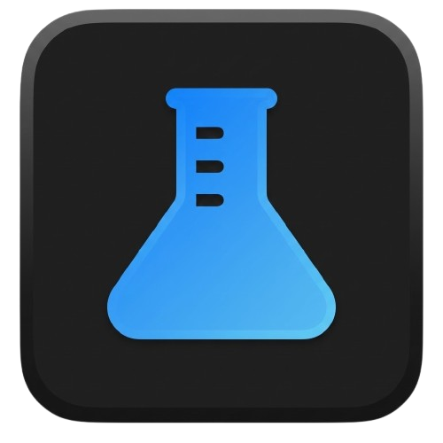
</p>

<p align="center">
  <strong>A native Android app for searching and exploring chemical compounds.</strong><br/>
  Built for students, researchers, and anyone curious about chemistry.
</p>

<p align="center">
  <a href="https://github.com/FurtherSecrets24680/chemsearch-android/releases">
    
  </a>
  
  
  
</p>

<p align="center">
<a href="https://www.producthunt.com/products/chemsearch?embed=true&amp;utm_source=badge-featured&amp;utm_medium=badge&amp;utm_campaign=badge-chemsearch" target="_blank" rel="noopener noreferrer"></a>
</p>

## Download
- Grab the latest APK from [GitHub Releases](https://github.com/FurtherSecrets24680/chemsearch-android/releases).
- Or build from source (see below).

---
## Features

### Search
- Search by common name, IUPAC name, CAS number, or CID via PubChem PUG REST
- Real-time **autocomplete suggestions** as you type, with a scrollable dropdown (toggleable)
- **Recent searches** tab to access recently searched compounds.
- **Favorites** tab with filtering, A-Z and atom-count sorting, and manual reordering.

### Compound Data
- Compound header showing name, molecular formula, molecular weight, CID and CAS at a glance
- Full identifiers card: IUPAC name, SMILES (full and connectivity), InChI, InChIKey, empirical formula, and formal charge (tap any value to copy).
- **Info tooltips** on each card explaining what each identifier or data type means
- Up to 8 **synonyms** displayed as chips
- **Elemental analysis** with mass percentage bars for each element
- Tap the formula to jump into the Isomer Finder

### Structure Viewer
- **2D structure** via PubChem PNG images with tap-to-zoom
- **3D model** using a fully native Canvas-based engine:
    - Drag to rotate, pinch to zoom, auto-spin with pause on touch
    - CPK coloring for all 118 elements
    - Ball-and-stick model with bonds connected to atom surfaces
- **Download** 2D PNG or 3D SDF files directly to Downloads

### Safety Information
- GHS classification fetched from PubChem PUG View:
    - Signal word badge (Danger / Warning) with color coding
    - GHS pictograms (GHS01 through GHS09) with icons and labels
    - Hazard H-codes

### Descriptions
Three switchable sources per compound:
- **PubChem** for scientific descriptions
- **Wikipedia** for general summaries
- **AI** via Google Gemini or Groq, with a regenerate button. This is totally optional and it requires your API key from these providers to work.

### Tools
Eleven chemistry tools accessible from the Tools tab:

- **Custom 3D Molecule Viewer** : Load any `.sdf` or `.mol` file from your device and view it in the native 3D engine
- **Molar Mass Calculator** : Enter any molecular formula (including parentheses groups and hydrate dot notation) to get the molar mass and a full elemental breakdown by mass percentage
- **Oxidation State Finder** : Determine oxidation states for each element in a compound, with support for peroxides, superoxides, ozonides, metal hydrides, and interhalogen compounds. Enter the overall charge for polyatomic ions
- **SMILES Visualizer** : Paste any SMILES string to look it up on PubChem and view its 2D structure and 3D model
- **Reaction Balancer** : Balance any chemical equation using matrix-based Gaussian elimination with exact rational arithmetic. Includes quick-insert buttons and swap-sides control
- **Isomer Finder** : Find up to 20 structural isomers by searching with a molecular formula
- **Limiting Reagent** : Identify limiting reagent, ratios, and theoretical yield for a balanced equation
- **Percent Yield** : Compare actual yield against theoretical yield for a target product
- **Reaction Scaling** : Scale reactants for a desired product amount
- **Dilution Calculator** : Solve C1V1 = C2V2 for solutions
- **Ideal Gas Law** : Solve PV = nRT for gases

Tool categories include scrollable filter pills and manual tool reordering.

### Customization
- **Theme mode** dropdown (Light / Dark) in Settings
- Configurable default description source
- AI provider selection with per-provider API key management
- Autosuggestions toggle (scrollable dropdown, toggleable)

### Updates and Cache
- Built-in update checks against GitHub releases, with optional notifications
- Local compound cache to speed repeat searches, with clear + custom location controls
- Cached results are labeled in the UI

### Developer Options
A hidden debug menu can be unlocked by tapping the build number in the 'About' card five times. It includes:
- **Live log viewer** : Real-time in-app log buffer (up to 200 lines) capturing search events, API calls, errors, SDF loads, and more, with timestamps. Errors always captured; verbose logs toggle-gated
- **Verbose logging toggle** : Writes detailed `D/ChemSearch` lines to Logcat and the live buffer
- **SharedPreferences inspector** : Dumps all stored keys and values (API keys partially masked)
- **Memory info** : JVM heap usage and system RAM from `ActivityManager`
- **API endpoints** : Copies all five base URLs to clipboard for manual testing
- **Wipe SharedPreferences** : Completely reset all the stored data
- **Force crash** : Throws a deliberate unhandled exception to verify crash reporting (confirmation required)
- **Hide debug settings** : Relock the developer menu until the next 5-tap unlock

---

## Screenshots
|                                                    |                                                     |                                                     |
|:--------------------------------------------------:|:---------------------------------------------------:|:---------------------------------------------------:|
| 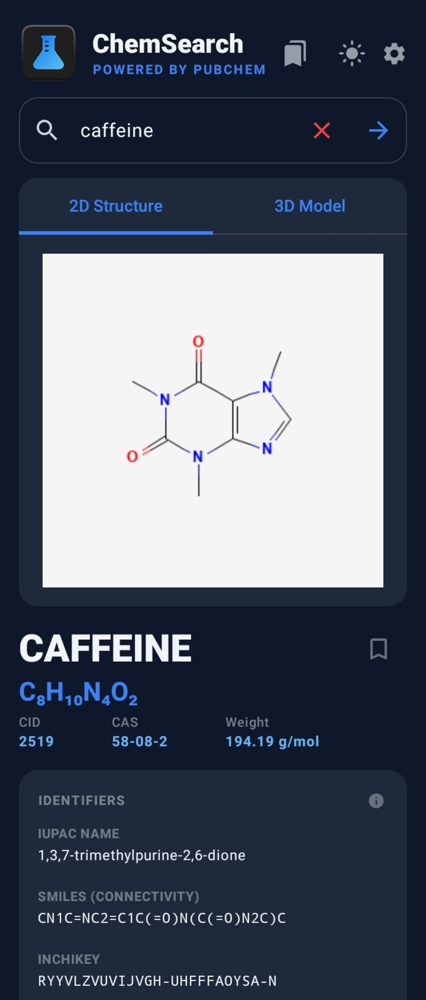 | 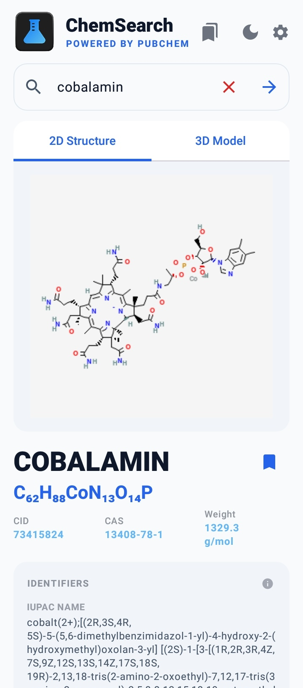 | 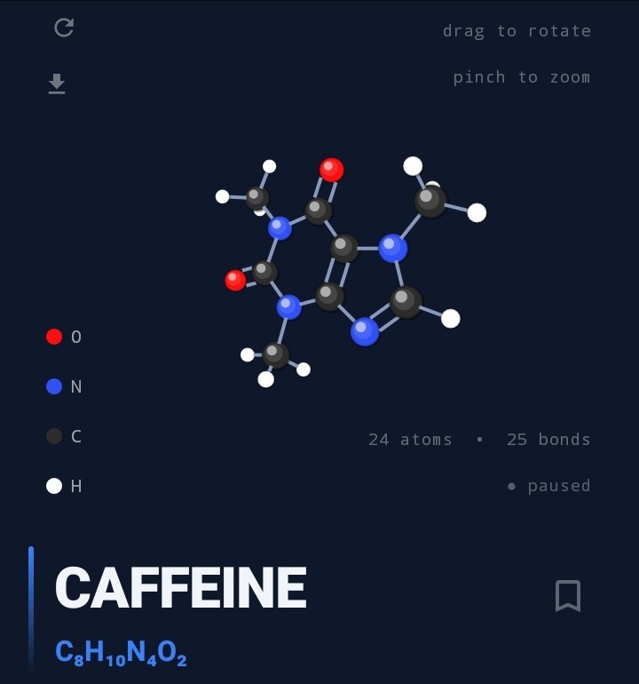 |
|                 Search (Dark mode)                 |                 Search (Light mode)                 |                 3D Molecule Viewer                  |
| 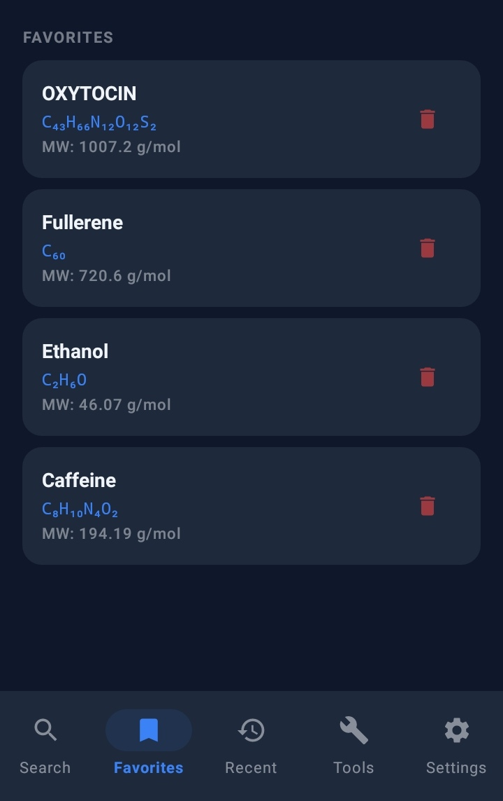 | 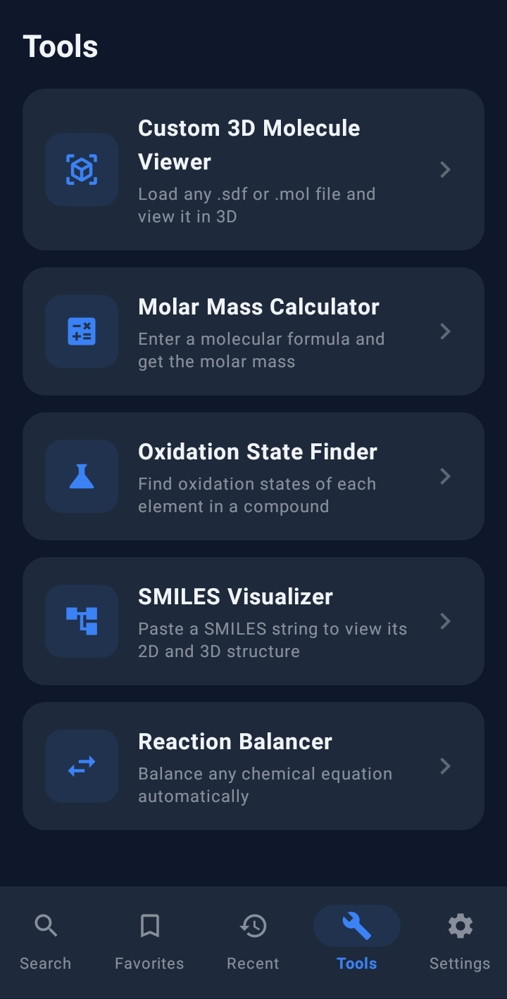 |  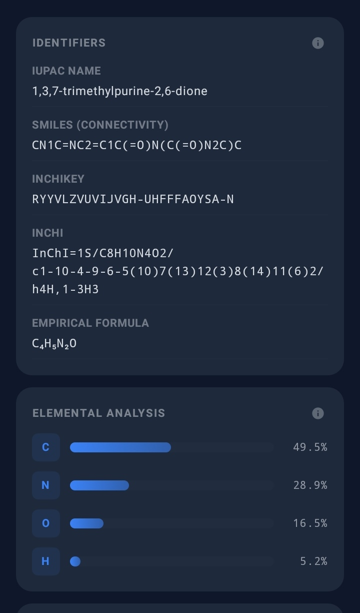   |
|                     Favorites                      |                     Tools Page                      |           Identifiers & Element Analysis            |
| 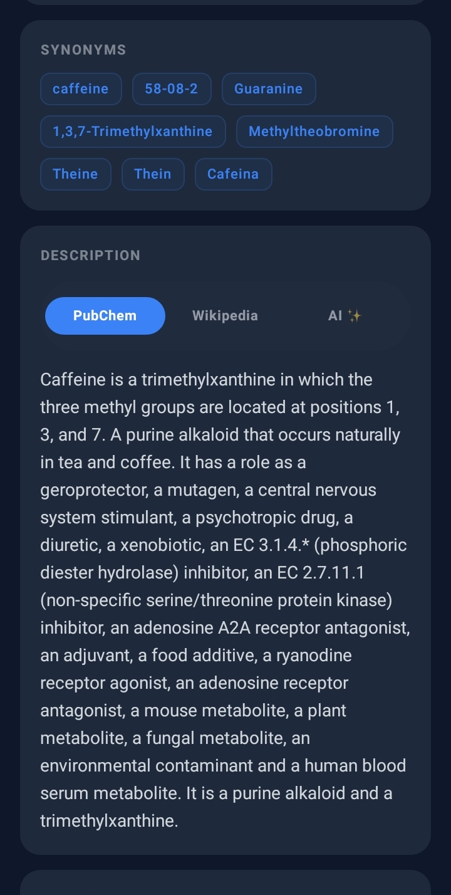  | 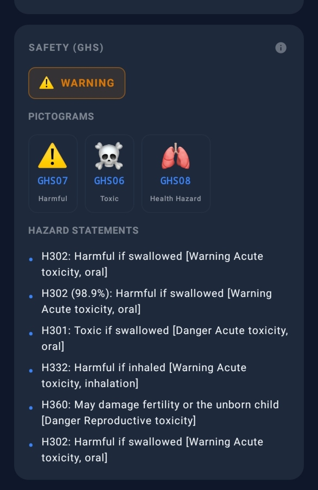 |  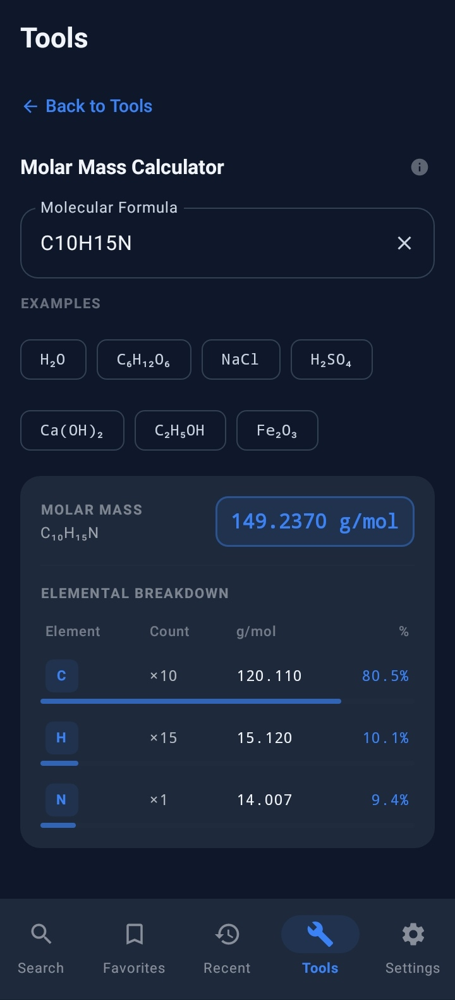  |
|               Synonyms & Description               |               GHS Safety Information                |                Molar Mass Calculator                |
| 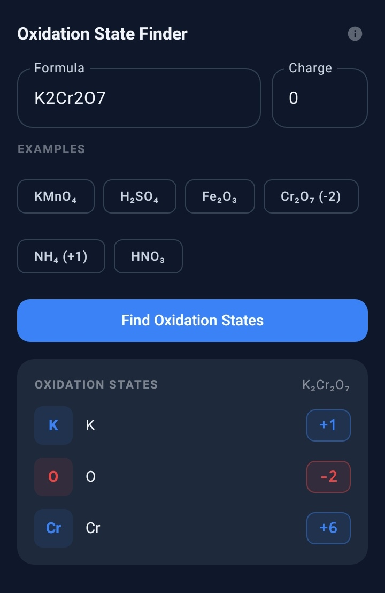  |  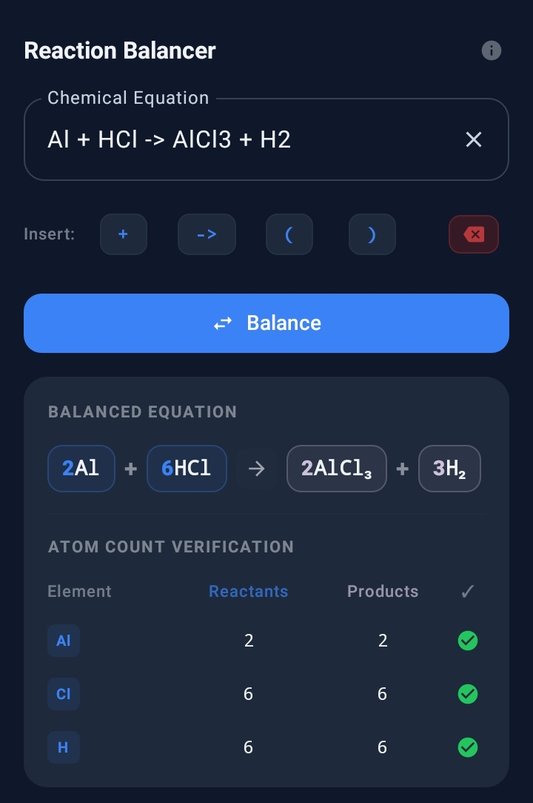   |  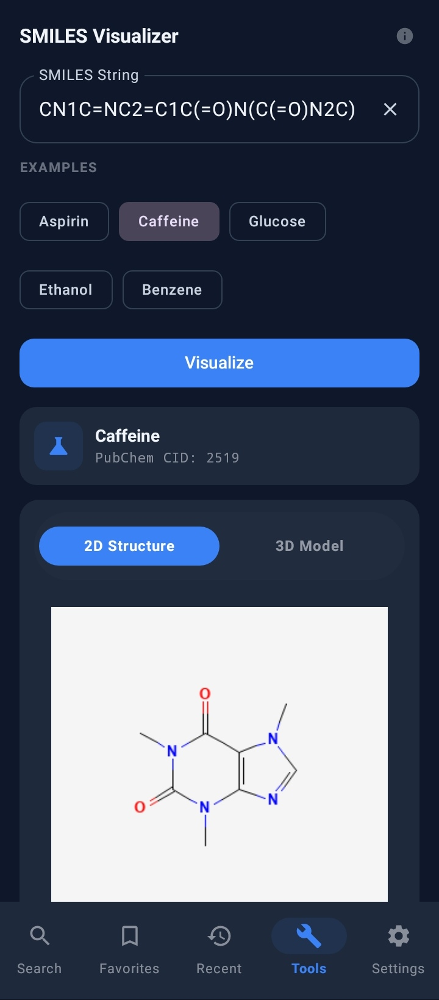   |
|               Oxidation State Finder               |                  Reaction Balancer                  |                  SMILES Visualizer                  |

---

## Tech Stack

| Component     | Technology                                             |
|---------------|--------------------------------------------------------|
| Language      | Kotlin                                                 |
| UI            | Jetpack Compose + Material 3                           |
| Networking    | Retrofit 2 + OkHttp                                    |
| Image loading | Coil                                                   |
| Async         | Kotlin Coroutines + StateFlow                          |
| JSON          | Gson                                                   |
| 3D rendering  | Custom native Canvas engine                            |
| Storage       | SharedPreferences                                      |
| Versioning    | Git tag-based version name + commit count version code |

---

## Data Sources

| Source                                                             | Used for                                                               |
|--------------------------------------------------------------------|------------------------------------------------------------------------|
| [PubChem PUG REST](https://pubchem.ncbi.nlm.nih.gov/docs/pug-rest) | Compound lookup, properties, synonyms, descriptions, SDF, autocomplete |
| [PubChem PUG View](https://pubchem.ncbi.nlm.nih.gov/docs/pug-view) | GHS safety classifications                                             |
| [Wikipedia REST API](https://en.wikipedia.org/api/rest_v1/)        | Compound summaries                                                     |
| [Google Gemini](https://ai.google.dev/)                            | AI descriptions                                                        |
| [Groq](https://groq.com/)                                          | AI descriptions                                                        |
| [GitHub Releases API](https://docs.github.com/en/rest/releases/releases) | Update checks                                                     |

---

## Requirements

### For Users
- Android 8.0 (Oreo) or higher (API 26+)
- Internet connection for compound data and AI descriptions

### For Developers
- Android Studio Hedgehog (2023.1.1) or newer
- JDK 11
- Android SDK API 36

---

## Permissions

- `INTERNET` for compound data, suggestions, descriptions, and update checks
- `POST_NOTIFICATIONS` (Android 13+) for optional update notifications
- `WRITE_EXTERNAL_STORAGE` (Android 9 and below) to save 2D PNG and 3D SDF downloads

---

## Building from Source

```bash
git clone https://github.com/FurtherSecrets24680/chemsearch-android
cd chemsearch-android
./gradlew assembleDebug
```

Open in Android Studio, sync Gradle, and run on a device or emulator (API 26+). Debug builds work without any API keys configured.

To install a debug build on a connected device:

```bash
./gradlew installDebug
```

### Release Signing

Release builds require a `keystore.properties` file in the project root:

```properties
storeFile=path/to/your.keystore
storePassword=yourStorePassword
keyAlias=yourKeyAlias
keyPassword=yourKeyPassword
```

Then build via `./gradlew assembleRelease` or **Build → Generate Signed APK**.

---

## AI Descriptions (Optional)

AI descriptions require a free API key from your chosen provider, entered in the app's Settings.

| Provider      | Model                 | Get an API key                                                       |
|---------------|-----------------------|----------------------------------------------------------------------|
| Google Gemini | `gemini-flash-latest` | [aistudio.google.com/api-keys](https://aistudio.google.com/api-keys) |
| Groq Cloud    | `openai/gpt-oss-120b` | [console.groq.com/keys](https://console.groq.com/keys)               |

Keys are stored locally on your device and only sent directly to the respective provider.

---

## Privacy

- Data is fetched directly from PubChem, Wikipedia, Gemini, Groq, and GitHub Releases. No intermediary servers are used.
- API keys, search history, favorites, and cache settings are stored locally using `SharedPreferences`. Cached compound data is stored locally on device.
- No analytics, tracking or telemetry of any kind.

---
<a href="https://www.star-history.com/?repos=furthersecrets24680%2Fchemsearch-android&type=timeline&logscale=&legend=top-left">
 <picture>
   <source media="(prefers-color-scheme: dark)" srcset="https://api.star-history.com/image?repos=furthersecrets24680/chemsearch-android&type=timeline&theme=dark&legend=top-left" />
   <source media="(prefers-color-scheme: light)" srcset="https://api.star-history.com/image?repos=furthersecrets24680/chemsearch-android&type=timeline&legend=top-left" />
   
 </picture>
</a>
---

## License

MIT License. See [LICENSE](LICENSE) for details.

---
