# ChemSearch for Android

<p align="center">
  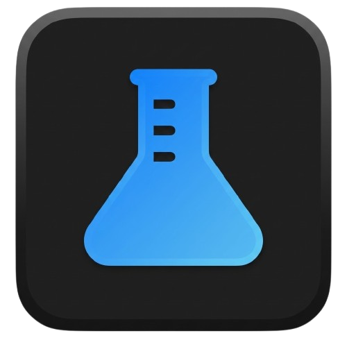
</p>

<p align="center">
  <strong>ChemSearch: Chemistry simplified.</strong><br/>
  Search compounds and structures, browse chemistry references and use practical chemistry tools.
</p>

<p align="center">
  <a href="https://github.com/FurtherSecrets24680/chemsearch-android/releases">
    
  </a>
  <a href="https://github.com/FurtherSecrets24680/chemsearch-android/releases">
    
  </a>
  
  
  
</p>

<p align="center">
  <a href="https://f-droid.org/packages/com.furthersecrets.chemsearch">
    
  </a>
  &nbsp;&nbsp;
  <a href="https://apps.obtainium.imranr.dev/redirect.html?r=obtainium://add/https://github.com/FurtherSecrets24680/chemsearch-android" target="_blank" rel="noopener noreferrer">
    
  </a>
  &nbsp;&nbsp;
  <a href="https://www.producthunt.com/products/chemsearch?embed=true&amp;utm_source=badge-featured&amp;utm_medium=badge&amp;utm_campaign=badge-chemsearch" target="_blank" rel="noopener noreferrer">
    
  </a>
</p>

---

##  About

ChemSearch is an Android chemistry reference and study app. Search for a compound, check its formula and identifiers, view 2D or 3D structures, read safety data, save results for offline use or use one of the built-in chemistry tools.

It also includes a Periodic Table, a local Chemical Database, Isomer Search, Structure Search, compound comparison, home-screen widgets, recent searches and launcher shortcuts.

It is aimed at students, teachers and anyone who wants chemistry data and common calculations in one app. It is not a replacement for an SDS, lab rules or other official safety guidance.

##  Highlights

- **Compound Search:** Search by name, CAS number, formula, PubChem CID or drawn structure. You can also open a random PubChem compound.
- **Advanced Search:** Filter by query type, included or excluded elements, molecular weight, charge, 3D data, GHS data, result count and name text.
- **Structure Search:** Draw a structure and search PubChem by exact, similar, substructure or superstructure matching.
- **Isomer Search:** Search by molecular formula and inspect isomer structures, formula details, mass, atom count, degrees of unsaturation and sorted results.
- **Compound Results:** View formulas, identifiers, 2D structures, 3D models, descriptions, synonyms and GHS data when available.
- **Offline Library:** Save compounds with their available data and export your library as CSV or JSON.
- **Compound Comparison:** Compare up to six compounds and copy values from individual rows.
- **Periodic Table:** Browse all 118 elements, filter by category, inspect trends and open element details.
- **Chemical Database:** Browse 575 substances, 108 ions, 71 functional groups and 149 reactions without an internet connection.
- **Reaction Predictor:** Use an offline rule set to predict common reaction products, observations, conditions and reaction types.
- **Home Screen:** Get a daily compound, use the random compound widget and open Search, Library, Tools or Settings from launcher shortcuts.
- **Display Options:** Use light or dark themes, AMOLED mode, five color schemes, compact mode, reduced motion, high-contrast outlines, temperature units, cards mode and haptic feedback.
- **Localization:** Choose from 16 language options, with each language shown by its native name in the language picker.

##  Localization

ChemSearch has 16 language options:

- English
- Bengali
- Danish
- German
- Greek
- Spanish
- Finnish
- French
- Italian
- Japanese
- Dutch
- Norwegian
- Polish
- Portuguese
- Russian
- Swedish

Translations cover the app UI, including tools, dialogs, widgets and other added strings. Language selection is available in **Settings > Language**. The translations are maintained with help from [Crowdin](https://crowdin.com/).

##  Download for Android

- Download the latest stable APK from [GitHub Releases](https://github.com/FurtherSecrets24680/chemsearch-android/releases) or [F-Droid](https://f-droid.org/packages/com.furthersecrets.chemsearch/).
  - Runs on Android 8.0 Oreo and newer.
  - Minimum SDK: API 26.
  - Target SDK: API 34.
  - Compile SDK: API 36.

- **Preview builds via GitHub Actions**
  1. Open the [APK build workflow](https://github.com/FurtherSecrets24680/chemsearch-android/actions/workflows/build.yml) in the **Actions** tab.
  2. Click **Run workflow**, choose the branch and start the workflow.
  3. Open the completed run and find the APK ZIP under **Artifacts**.
  4. Extract the ZIP to get the APK.

> [!NOTE]
> A debug APK may not install over an existing release APK if the signing keys do not match. In that case, uninstall the existing build first, then install the new one.

##  Screenshots

Click a section to view screenshots.

<details>
<summary><strong>Search and Results</strong></summary>

| Home | 2D Result | Identifiers |
| :---: | :---: | :---: |
| 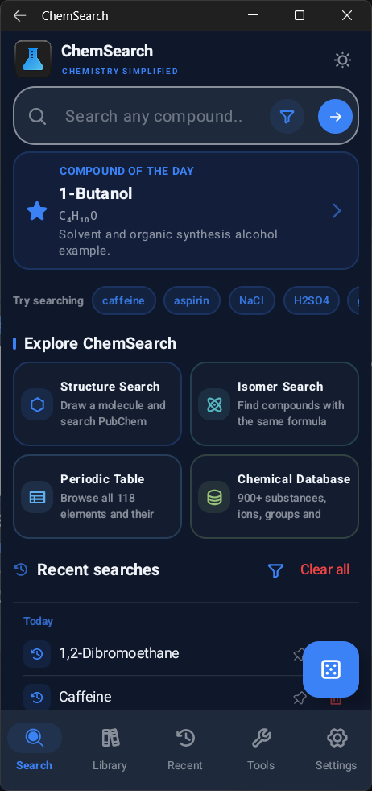 | 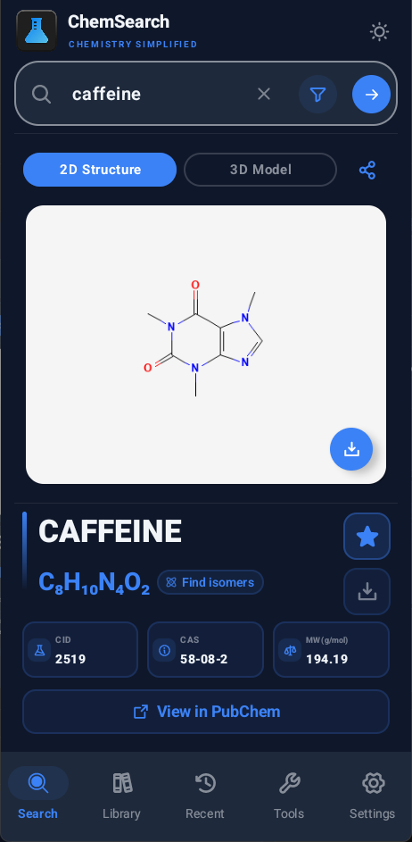 | 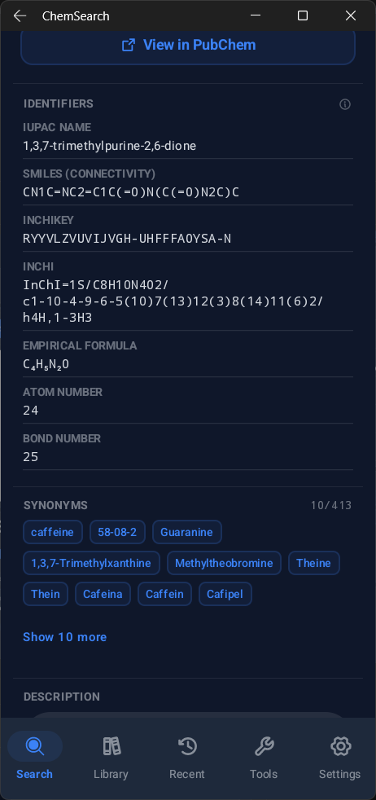 |

| Description and GHS | 3D Result |
| :---: | :---: |
| 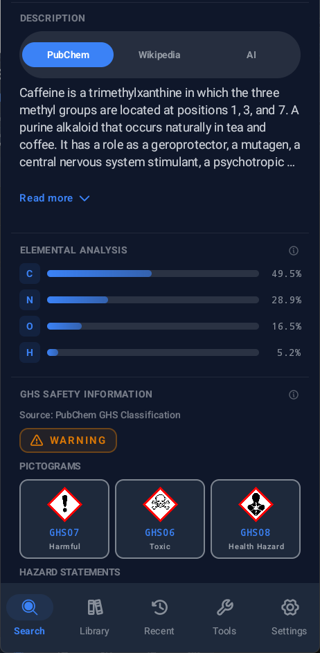 | 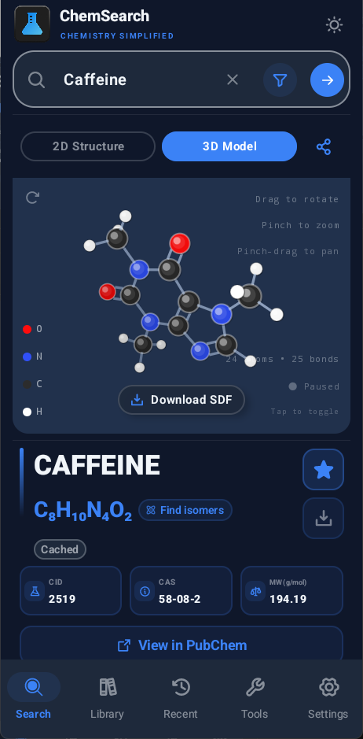 |

</details>

<details>
<summary><strong>Library and Reference</strong></summary>

| Periodic Table | Chemical Database |
| :---: | :---: |
| 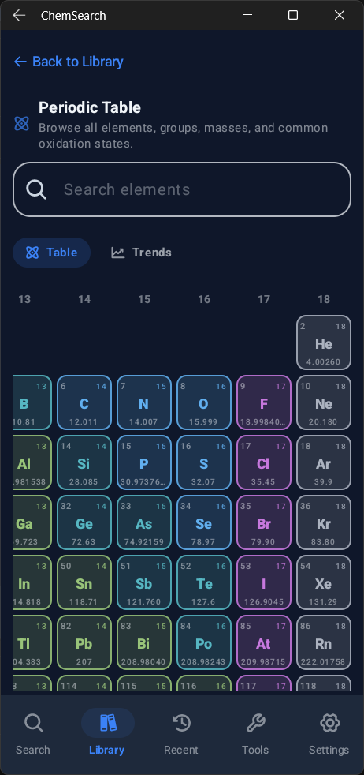 | 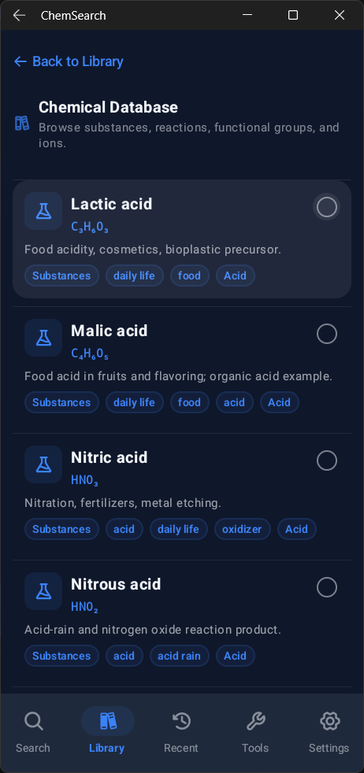 |

</details>

<details>
<summary><strong>Structure and Formula Search</strong></summary>

| Structure Search | Isomer Search |
| :---: | :---: |
| 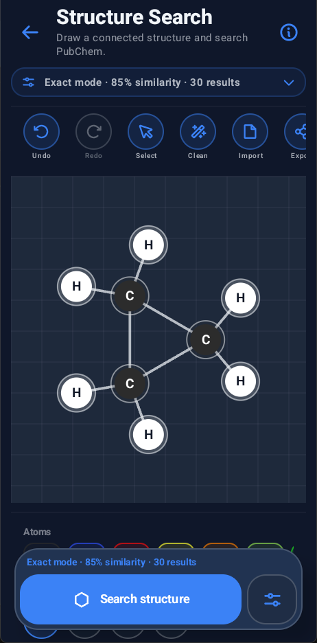 | 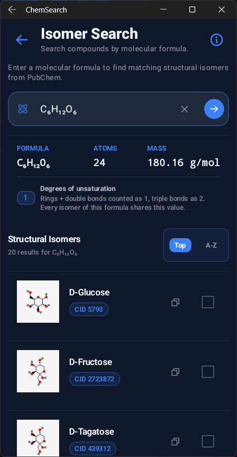 |

</details>

<details>
<summary><strong>Tools</strong></summary>

| Tools List | Reaction Balancer | Reaction Predictor |
| :---: | :---: | :---: |
| 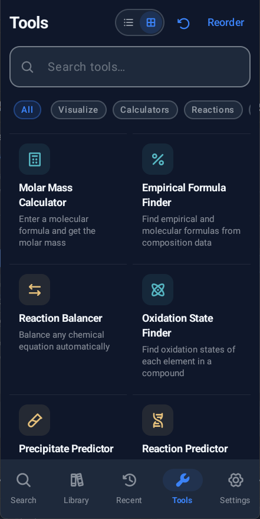 | 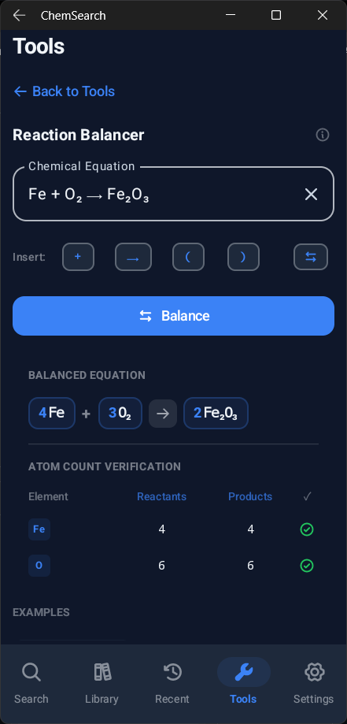 | 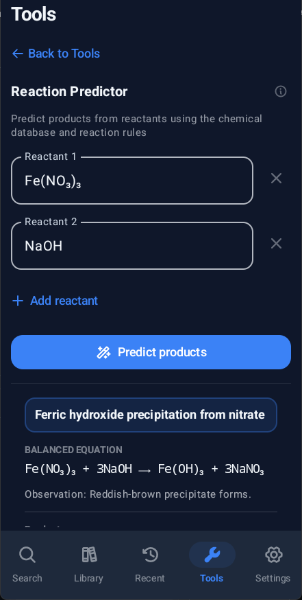 |

| Molar Mass | Oxidation State | Compare Compounds |
| :---: | :---: | :---: |
| 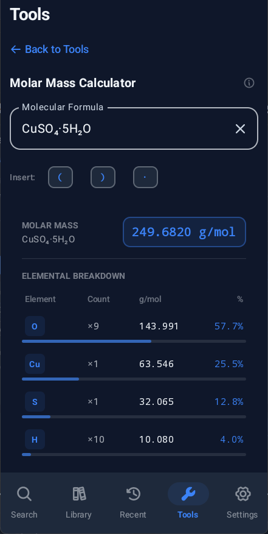 | 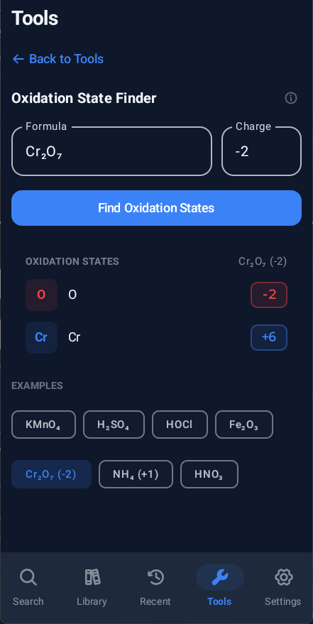 | 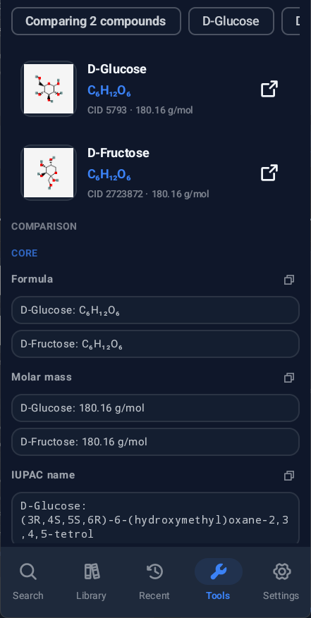 |

| Stoichiometry |
| :---: |
| 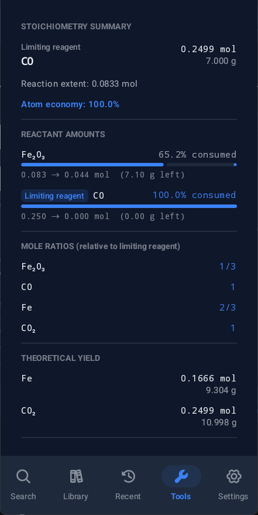 |

</details>

<details>
<summary><strong>Themes and Settings</strong></summary>

| Display Settings | Light Blue | Dark Violet |
| :---: | :---: | :---: |
| 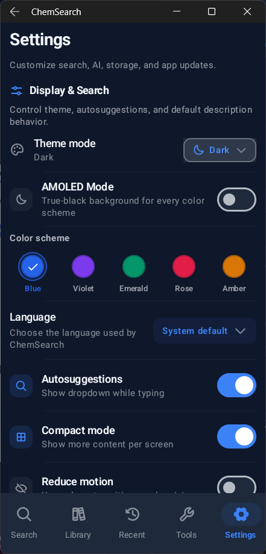 | 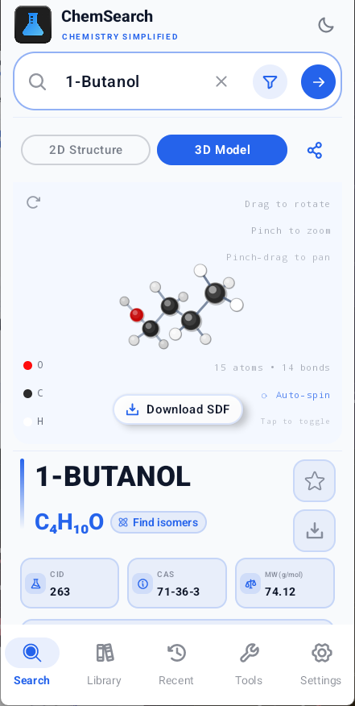 | 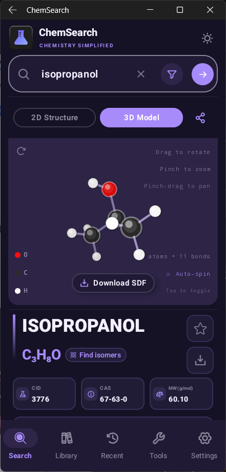 |

| Dark Emerald | Dark Rose | Dark Amber |
| :---: | :---: | :---: |
| 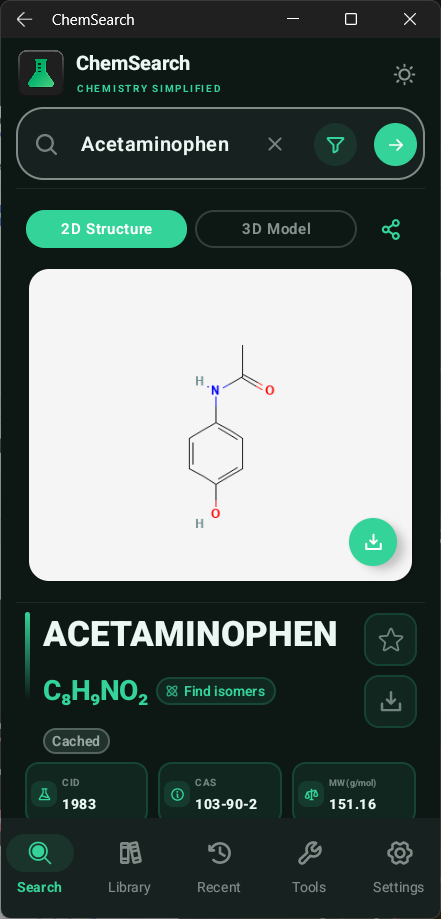 | 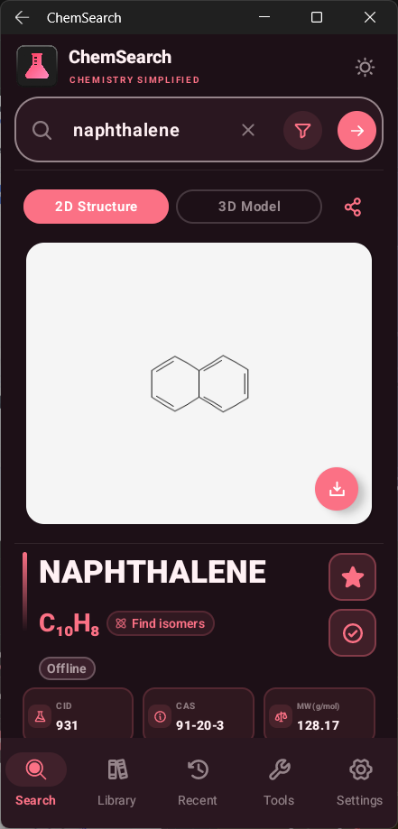 | 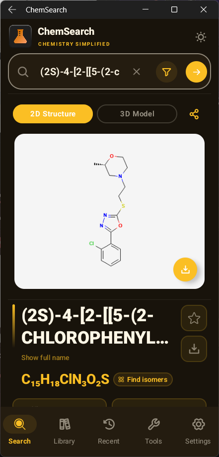 |

</details>

##  Compound Search

ChemSearch can look up compounds using:

- A name, such as `glucose`, `sodium chloride`, `sulfuric acid` or `1,3-dibromopropane`
- A CAS number
- A molecular formula
- A PubChem CID
- A drawn structure

Autosuggestions can appear while you type. Repeated searches can load from the local cache instead of fetching the same data again.

When a name has no match or contains a typo, ChemSearch can suggest a close spelling.

Search errors are separated by type. A throttled request, timeout, bad request, network problem, server error or empty result gets its own message and visual treatment.

### Advanced Search

Advanced Search supports:

- Query type
- Include and exclude terms
- Molecular weight range
- Charge
- Require 3D data
- Require GHS data
- Result limit
- Name-contains filtering

The active-filter indicator shows how many filters are in use and provides a clear-all action.

### Compound Results

A result can include:

- Compound name and formula
- CID, CAS number, molecular weight, condensed formula and empirical formula when available
- IUPAC name, InChI, InChIKey, SMILES and synonyms
- 2D structure image
- 3D structure model
- GHS safety information and pictograms when available
- Descriptions from PubChem, Wikipedia or an enabled AI provider
- Additional PubChem properties such as uses, occurrence notes, classification tags, XLogP, polar surface area, exact mass, hydrogen bond counts and rotatable bond count
- Isomer Search from the formula
- Favorite and offline download actions

Additional PubChem data is behind **Show more information about this substance** to keep the main result page readable.

Tap identifiers and quick stats to copy them.

The home screen also includes an in-app Compound of the Day card. It shows the same daily compound used by the daily widget, including its formula and typical uses. The Explore section links to Structure Search, Isomer Search, the Periodic Table and the Chemical Database.

A random compound button picks a PubChem CID from the app's configured random-compound range and opens it like a normal search result.

### Formula Display

Formula display supports two styles:

- **Conventional:** Common ordering such as `NaCl`, `H2SO4` and `NH4+`
- **Hill:** Hill-system ordering such as `ClNa` or `H4N+` when that is the source formula

##  Structure Search

Structure Search uses a native drawing page. Build a molecule from atoms, bonds, templates and charges, choose a matching mode, then open the results in the normal compound page.

The editor includes:

- Common atoms plus a full periodic-table picker
- Bond types and structure templates
- CPK-style atom colors
- Select, drag, undo, redo, delete, clean, duplicate, import, export and share actions
- Exact, similar, substructure and superstructure search
- A configuration summary showing the active mode, similarity threshold and result limit
- A similarity slider with a fine-grained value selector
- Search-button and result-dialog summaries showing the active configuration
- Import hints for SMILES, InChI and V2000 MOL input
- A live formula badge for the current sketch
- Matching results in a pop-up dialog

##  Isomer Search

Isomer Search finds compounds that share a molecular formula.

While entering a formula, ChemSearch can show an instant formula summary with:

- Normalized formula
- Total atom count
- Molar mass
- Degrees of unsaturation

The formula summary also reports when the input is invalid.

Search results can be sorted by relevance or name. When isotope results are present, an isotope filter can be used to include or exclude them.

Each result shows the structure and compound information, supports selection for comparison and includes a quick copy action. Failed searches use the same typed error handling as normal Search and can be retried.

##  Structures

ChemSearch loads structure data from PubChem when it is available.

- 2D structure images appear on the compound page.
- Tapping a 2D image opens a larger view.
- 3D models open in the built-in viewer. The viewer is native and does not use a WebView.
- The default structure tab can be set to 2D, 3D or the last used tab.
- The 3D viewer supports drag rotation, pinch zoom, pinch-drag panning, reset and auto-spin.
- When PubChem has no 3D model, ChemSearch can try fallback data from identifiers such as SMILES, InChI and InChIKey. Fallback structures are marked as such.

Some atoms, metal compounds, ionic solids and crystal-like materials do not have a useful standalone molecular model. In those cases, ChemSearch explains the missing model or labels a fallback as an estimate.

##  Descriptions

Descriptions can come from:

- PubChem
- Wikipedia
- A configured AI provider

Supported AI providers are Google Gemini, Groq Cloud, OpenAI, OpenRouter and Mistral AI.

ChemSearch can refresh provider model lists and lets you choose a model for each provider.

When AI descriptions are enabled, the request can include compound details such as formula, identifiers, safety data and source context. API keys are stored locally with Android Keystore.

##  Library

The Library contains saved compounds and reference data:

- **Favorites:** Saved compounds for quick access
- **Downloads:** Saved compounds for offline viewing
- **Reference:** Periodic Table and Chemical Database

Removing a favorite or downloaded compound provides an undo action.

Long-press a library card to:

- Copy its formula
- Open the compound in PubChem
- Remove it

Favorites, downloads, supported database entries and ions can be selected for comparison.

### Compare Compounds

Compare up to six compounds side by side. The comparison can include formulas, descriptions, identifiers, atom counts, bond counts, molecular weight and other available properties.

Individual rows can be copied and the results can be cleared without starting another comparison.

### Periodic Table

The Periodic Table contains all 118 official elements.

It includes:

- Element search
- Interactive category filtering
- Short element dialogs
- Full element detail pages
- Wikipedia summaries
- Element images
- Electron-shell diagrams with short and full electronic configurations
- Physical properties such as electronegativity, atomic radius, ionization energy, melting point, boiling point, density and molar heat
- Spectral-line images

#### Trends

Trend views cover electronegativity, atomic radius, ionization energy, density, melting point and boiling point.

Temperature trends can use Kelvin, Celsius or Fahrenheit from the app settings.

The trend view uses a blue-to-orange heatmap, a min/max legend and a top-five strip that opens an element detail page.

### Chemical Database

The bundled Chemical Database is available offline and contains:

- 575 substances
- 108 ions
- 71 functional groups
- 149 reactions

The substance collection includes acids, salts, organic families, polymers, alloys, drugs, dyes, biomolecules and other common chemistry references.

Entries can be searched by name, alias or formula and filtered by type. The reaction entries are also used by the Reaction Predictor.

The 118 elements are kept in the Periodic Table instead of being duplicated in the substance list.

### Offline Downloads

A downloaded compound can include:

- Basic compound details
- 2D structure image
- 3D structure data when available
- Identifiers
- Descriptions
- Synonyms
- GHS safety information
- Data source notes

Download quality can be set to Basic, Structures or Complete.

Downloads are stored in the local app database. The save action shows progress while data is being stored.

Library import and export can move favorites and downloads between installs or devices. Library export supports both CSV and JSON.

##  Home-Screen Widgets and Shortcuts

ChemSearch has two home-screen widgets.

- **Compound of the Day:** Uses the calendar date and bundled database to pick the same compound on every device for that date. It changes at local midnight.
- **Random Compound:** Shows a random substance and has a refresh button. It avoids showing the same pick twice in a row.

Both widgets work offline. They render chemical formulas with Unicode subscripts and superscripts and open Search with the displayed compound when tapped.

Widget labels use the selected app language.

Long-press the app icon to access shortcuts for:

- Search
- Library
- Tools
- Settings

##  Recent Searches

The Recent screen keeps search history organized by time.

- Pin important searches
- Sort by newest or oldest
- Browse pinned searches, today, yesterday, the previous 7 days, the previous 30 days and older searches
- Remove individual entries
- Clear all recent searches

##  Tools

ChemSearch includes 15 tools:

- **Molar Mass Calculator:** Parse a formula and calculate molar mass.
- **Empirical Formula Finder:** Calculate empirical and molecular formulas from composition data or a molecular formula.
- **Oxidation State Finder:** Estimate oxidation states for many common compounds, including peroxides, superoxides, ozonides, hydrides, oxyhalogens and mixed-valence cases.
- **pH / pOH Calculator:** Convert between pH, pOH, hydrogen ion concentration and hydroxide ion concentration.
- **Reaction Balancer:** Balance chemical equations.
- **Precipitate Predictor:** Check two aqueous salts for likely precipitates and net ionic equations.
- **Limiting Reagent:** Find the limiting reagent, mole ratios, theoretical yield, reagent consumption, leftover amounts and atom economy.
- **Percent Yield:** Compare actual yield with theoretical yield.
- **Reaction Scaling:** Scale reactants for a target product amount.
- **Dilution Calculator:** Calculate concentration and volume changes with `C1V1 = C2V2`.
- **Ideal Gas Law:** Work with pressure, volume, amount and temperature using `PV = nRT`.
- **SMILES Visualizer:** Open structure data from SMILES input.
- **Custom 3D Molecule Viewer:** Load local `.sdf` or `.mol` files.
- **Reaction Predictor:** Enter reactants and get likely products, reaction type, observations, conditions and the rule or database entry used for the result.
- **Compare Compounds:** Compare up to six compounds and copy values from individual property rows.

The Tools page supports search, categories, list and grid layouts, compact mode, drag reordering and reset to the default order.

The grid adapts to the available width, using 2 columns on narrow phones and up to 5 columns on wider screens and tablets. Tool categories have their own accent colors.

### Reaction Predictor

The Reaction Predictor uses the bundled Chemical Database and an offline rule set. It is intended for common study reactions rather than unusual chemistry.

Examples include:

- Acid + base neutralization
- Acid + carbonate
- Metal + acid
- Single displacement
- Combustion
- Metal + water
- Metal + steam
- Acid + metal oxide
- Acid + sulfite
- Acid + sulfide
- Ammonium salt + base
- Simple synthesis reactions

The result can include predicted products, a balanced equation, observations, conditions and a confidence level.

##  Display and Settings

ChemSearch includes settings for appearance, search behavior, storage, language, AI providers and app updates.

### Display

- Light and dark theme
- AMOLED mode for true-black backgrounds
- Blue, Violet, Emerald, Rose and Amber color schemes
- Temperature unit: Kelvin, Celsius or Fahrenheit
- Compact mode
- Reduce motion
- High-contrast outlines
- Cards mode, which can switch rounded card surfaces to a flatter page style
- Haptic feedback

### Search and Data

- Autosuggestions
- Default description source
- Default structure view
- Formula style: Conventional or Hill
- Offline download quality
- Cache location
- Cache size limit: 10 MB, 50 MB, 100 MB or unlimited
- Cache auto-clear schedule: daily, weekly, monthly or manual
- Settings import and export
- Library CSV export and JSON backup/import

### Language

The language picker shows language names in their own language, such as `Deutsch`, `日本語` and `বাংলা`.

### Updates

GitHub builds can check for new releases, notify you about updates, download the APK with progress and show an install prompt when the download finishes.

### About

The About screen includes app links, credits, license information, privacy notes, project sources and a collapsible What's New section for the current version.

##  Developer Options

Developer options are unlocked by tapping the build number five times in the About card.

They include checks for:

- PubChem lookup
- PubChem structures
- PubChem safety data
- Wikipedia descriptions
- NCI/CADD fallback structures
- GitHub release checks in GitHub builds
- Configured AI providers

### Offline Test Mode

Offline Test Mode replaces network-backed data with local deterministic test data.

While it is enabled:

- Search and related lookups use dummy records
- Structure and safety requests can be simulated
- AI calls return local test responses
- Simulated latency can be adjusted
- A random error rate can be set
- A specific failure type can be forced
- The UI shows an offline banner
- The same query produces the same test result so UI states can be reproduced

Nothing is sent over the network while Offline Test Mode is active.

### Other Developer Tools

Developer options also include:

- Debug logs
- Notification tests
- Cache and storage summaries
- Compound cache inspection and clearing
- Device and build information
- Live memory information
- Localized search-error catalog
- Welcome-screen reset
- Cleanup tools

These tools are useful for testing error states, checking local storage or collecting device information for a bug report.

##  Built With

- [Kotlin](https://kotlinlang.org/)
- [Jetpack Compose](https://developer.android.com/compose)
- [Material 3](https://developer.android.com/develop/ui/compose/designsystems/material3)
- [AndroidX Navigation Compose](https://developer.android.com/develop/ui/compose/navigation)
- [AndroidX Lifecycle](https://developer.android.com/topic/libraries/architecture/lifecycle)
- [Phosphor Icons](https://phosphoricons.com/)
- [AndroidX Room](https://developer.android.com/training/data-storage/room)
- [AndroidX DataStore](https://developer.android.com/topic/libraries/architecture/datastore)
- [AndroidX WorkManager](https://developer.android.com/topic/libraries/architecture/workmanager)
- [Retrofit](https://square.github.io/retrofit/)
- [OkHttp](https://square.github.io/okhttp/)
- [Gson](https://github.com/google/gson)
- [Coil](https://coil-kt.github.io/coil/compose/)
- [Kotlin Coroutines](https://kotlinlang.org/docs/coroutines-overview.html)
- [Icons8](https://icons8.com/) for the Wikipedia logo used in element details

##  Data Sources

- [PubChem PUG REST](https://pubchem.ncbi.nlm.nih.gov/docs/pug-rest) for lookup, structure search, properties, synonyms, descriptions, images, isomers and SDF files
- [PubChem PUG View](https://pubchem.ncbi.nlm.nih.gov/docs/pug-view) for GHS safety data
- [UNECE GHS pictograms](https://unece.org/transport/dangerous-goods/ghs-pictograms) for hazard symbol artwork
- [PubChem Periodic Table](https://pubchem.ncbi.nlm.nih.gov/periodic-table/) for element properties
- PubChem autocomplete for search suggestions
- [Wikipedia REST API](https://en.wikipedia.org/api/rest_v1/) for general summaries
- [Wikimedia Commons](https://commons.wikimedia.org/) for element images and spectral-line images
- [Bowserinator/Periodic-Table-JSON](https://github.com/Bowserinator/Periodic-Table-JSON/) for extra element data, electron shells, image links and Wikipedia-derived element summaries
- [NCI/CADD Chemical Identifier Resolver](https://cactus.nci.nih.gov/chemical/structure) for fallback SDF models
- [GitHub Releases](https://docs.github.com/en/rest/releases/releases) for app update checks
- Local JSON files in `app/src/main/assets/chemical_database/` for offline chemistry data
- IUPAC, LibreTexts, PubChem and other chemistry references used for labels or source links in the local database
- Optional AI provider APIs: Gemini, Groq, OpenAI, OpenRouter and Mistral

##  Accuracy and Limits

ChemSearch is a study and reference tool. It is not a replacement for official safety documentation or a full chemistry reference.

- PubChem and Wikipedia results depend on the data available from those services.
- AI descriptions should be checked against source data for serious work.
- Fallback 3D structures are estimates when PubChem does not provide a usable model.
- Ionic, metallic and crystal structures may not be represented by one molecular 3D model.
- The oxidation state and formula tools cover many common cases. Unusual compounds may need manual checking.
- The Reaction Predictor covers common rule-based cases. It does not attempt to predict every chemical reaction, especially reactions that depend on special conditions, catalysts, complex mechanisms or unusual substrates.
- GHS information is provided for quick reference. Use the official SDS and applicable safety procedures for real handling decisions.

##  Project Structure

```text
.
|-- fastlane/
|   `-- metadata/android/en-US/
|-- metadata/
|-- app/
|   |-- build.gradle.kts
|   |-- proguard-rules.pro
|   `-- src/
|       |-- fdroid/
|       |-- main/
|       |   |-- assets/chemical_database/
|       |   |-- java/com/furthersecrets/chemsearch/
|       |   |   |-- data/
|       |   |   |   |-- local/
|       |   |   |   `-- settings/
|       |   |   |-- settings/
|       |   |   |-- updates/
|       |   |   |-- widget/
|       |   |   `-- ui/
|       |   `-- res/
|       |-- test/
|       |   |-- java/com/furthersecrets/chemsearch/
|       |   `-- resources/chemistry-fixtures/
|       `-- androidTest/
|-- .github/
|-- gradle/
|   `-- libs.versions.toml
|-- fastlane/metadata/android/en-US/images/phoneScreenshots/
|-- keystore.properties.example
|-- local.properties.example
|-- version.properties
|-- build.gradle.kts
|-- settings.gradle.kts
`-- README.md
```

Useful areas:

- `fastlane/metadata/android/en-US/` contains store listing text and release notes
- `metadata/` contains the draft F-Droid metadata file
- `app/src/main/java/com/furthersecrets/chemsearch/` contains the Android app code
- `app/src/main/java/com/furthersecrets/chemsearch/data/` contains API calls, chemistry calculations, parsing, search, settings and offline storage logic
- `app/src/main/java/com/furthersecrets/chemsearch/ui/` contains Compose screens, navigation, themes, settings, Library, Tools and structure drawing UI
- `app/src/fdroid/` contains F-Droid-specific changes
- `app/src/main/assets/chemical_database/` contains local chemistry JSON files
- `app/src/main/res/` contains images, icons and Android resources
- `app/src/test/` contains unit tests for chemistry logic, settings and UI helpers
- `.github/` contains GitHub project files
- `fastlane/metadata/android/en-US/images/phoneScreenshots/` contains README screenshots
- `version.properties` contains the app version name and version code

##  Build From Source

Requirements:

- Android Studio
- JDK 17+
- Android SDK API 36

Clone the repository:

```bash
git clone https://github.com/FurtherSecrets24680/chemsearch-android
cd chemsearch-android
```

Build a debug APK on macOS or Linux:

```bash
./gradlew :app:assembleGithubDebug
```

Build a debug APK on Windows:

```powershell
.\gradlew.bat :app:assembleGithubDebug
```

The debug APK is generated at:

```text
app/build/outputs/apk/github/debug/app-github-debug.apk
```

ChemSearch has two distribution flavors:

- `github`: normal GitHub builds with in-app update checks and APK install prompts
- `fdroid`: F-Droid builds without the GitHub APK updater or installer permission. AI providers remain available as optional user-configured features, so the F-Droid metadata declares `NonFreeNet`.

Build the F-Droid variant locally:

```powershell
.\gradlew.bat :app:assembleFdroidRelease
```

##  Signed Release Builds

For signed release builds, copy `keystore.properties.example` to `keystore.properties` and keep the keystore in the project-relative path shown in that example file.

The local signing files are ignored by Git:

```text
local.properties
keystore.properties
keystores/
*.jks
*.keystore
```

Build the release APK:

```powershell
.\gradlew.bat :app:assembleGithubRelease
```

The release APK is generated at:

```text
app/build/outputs/apk/github/release/app-github-release.apk
```

Release builds use Android's shrinker and resource shrinking to keep the APK smaller.

##  Privacy

- No analytics
- No tracking
- No app-owned server
- Compound data is fetched directly from the selected data source
- Drawn structures are sent to PubChem when you use Structure Search
- AI requests go directly to the selected AI provider
- API keys are encrypted locally with Android Keystore
- Settings export can include saved AI API keys in the JSON backup. Keep exported settings files private.
- Search history, favorites, downloads, settings and cache data stay on the device

##  License

MIT License. See [LICENSE](LICENSE) for details.

---

<a href="https://www.star-history.com/?repos=FurtherSecrets24680%2Fchemsearch-android&type=date&legend=top-left">
  <picture>
    <source media="(prefers-color-scheme: dark)" srcset="https://api.star-history.com/chart?repos=FurtherSecrets24680/chemsearch-android&type=date&theme=dark&legend=top-left&sealed_token=aBMOmSThnEfM7JZnhcDfg1YawaS4ZGNPep5cfmQpN1fwSvIsmXcdhZO6ih15UzoUjFVJuW4Rg3ZGd9Cln4ChTpK4gYSSf0LbylwCK0xxL4abKjE3HYkOFl8DA6Jpwr-8xM4TiSxBSRqbt4imcN8_3Jd6w8fpu57HYMEXYo140V20Q3tF4x6VorvqLlkX" />
    <source media="(prefers-color-scheme: light)" srcset="https://api.star-history.com/chart?repos=FurtherSecrets24680/chemsearch-android&type=date&legend=top-left&sealed_token=aBMOmSThnEfM7JZnhcDfg1YawaS4ZGNPep5cfmQpN1fwSvIsmXcdhZO6ih15UzoUjFVJuW4Rg3ZGd9Cln4ChTpK4gYSSf0LbylwCK0xxL4abKjE3HYkOFl8DA6Jpwr-8xM4TiSxBSRqbt4imcN8_3Jd6w8fpu57HYMEXYo140V20Q3tF4x6VorvqLlkX" />
    
  </picture>
</a>
